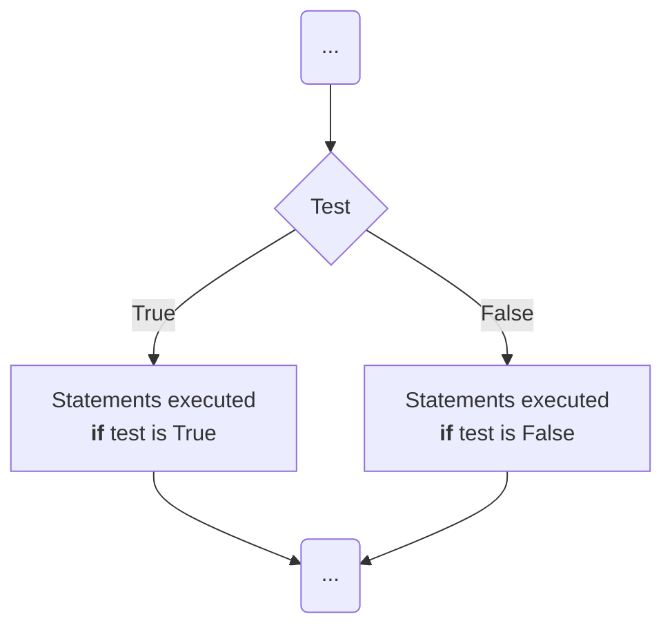

# Operation #5: Selection

SIPO style programming is not enough for all situations because there
are many areas in which the processing to be done depends on the input,
e.g.

-   the tax you pay _depends_ on how much you earn
-   the grade you receive _depends_ on the quality of your work
-   the formula to calculate the area of a figure _depends_ on its shape
-   the amount of leave an employee accumulates _depends_ on their
    employment status

To accommodate such situations we need the ability to process data
selectively. Imperative/procedural programming languages (like Python)
achieve this by using selection statements. To handle the cases above we
test something (your earnings, your work quality, the shape of the
figure, or someone's employment status) to determine how processing
should proceed. The result of the test is used to select the processing
to carry out.

The most common selection command is the `if` statement. In Python the
basic `if` statement looks like this (we'll see some variations next
week),

<!-- ```plaintext
if test :
    statements to do if the test is true
else:
    statements to do if the test is false
``` -->

  <pre><code class="pseudocode"><b>if</b> <i>test</i> :
    <i>statements to do if the test is true</i>
<b>else</b>:
    <i>statements to do if the test is false</i></code></pre>

The _test_ evaluates some condition, e.g. that the input is less than
100. If it is (that is, if the test is true), the first group of
statements are executed, and the second group of statements
(after `else`) are skipped. If the test is not true, then the first
group of statements is skipped, and the second group of statements are
executed. In either case only one of the two groups of statements is
executed. Thus the `if` statement selects which group of statements to
execute _depending_ on the outcome of the test.

This can be presented diagramatically by a flowchart like this:


