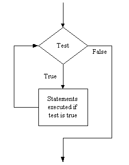

# Operation #6: Repetition

Some procedures require even more than SIPO-plus-Selection; they require
the ability to repeat a group of instructions, e.g.

-   continue firing the boiler _while_ the temperature is below the set
    point
-   process records from the file _until_ there are none left
-   increase the brightness by 10% _for every_ pixel in the image

In all these cases the same instructions are carried out multiple times
(and sometimes on multiple items). The final control structure allows us
to specify the repetition of commands. Python provides two repetition
statements `while`, and `for`. We will consider `while` here to get a
flavour of repetition. The format of the `while` statement is:

<!-- ```plaintext
while test :
    statements to repeat
``` -->

<pre><code class="pseudocode"><b>while</b> <i>test</i> :
    <i>statements to repeat</i></code></pre>

The effect of this construct is to continue executing the statements
"inside" the while, as long as the test is true, e.g.

<!-- ```plaintext
while the temperature is low :
    fire the boiler
``` -->

<pre><code class="pseudocode"><b>while</b> <i>the temperature is low</i> :
    <i>fire the boiler</i></code></pre>

Although the italicized portions are not Python statements I hope this
gives you a sense of the construct. When the program reaches
the `while` statement it evaluates the test. If the test is false it
skips over the indented statements and continues with the next statement
in the program (i.e. if the temperature is not low we do not fire the
boiler). If it is true however it executes the statements, and then
reevaluates the test (i.e. if the temperature is low we fire the boiler
and then check to see if the temperature is still low). If the test is
still true it executes the statements and reevaluates the test (i.e. if
the temperature is still low, fire the boiler again). If the test is
still true it executes the statements and reevaluates the test. This
continues until the test is false. Thus the statements are done while
the test is true.

Diagramatically this can be represented as,


