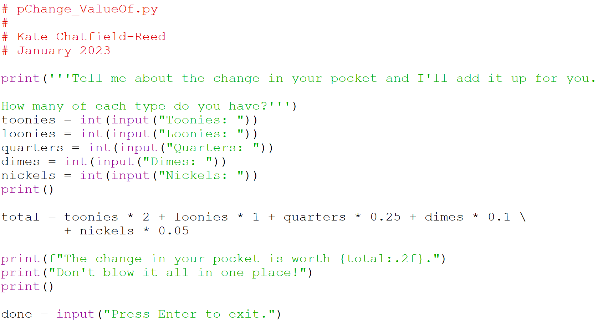

# Example: Value of your change

## Problem:

Write a program that will let the user enter the change they have in their pocket and will tell them its total value. A sample run might look like:

```plaintext
Tell me about the change in your pocket and I'll add it up for you.
How many of each type of coin do you have?
Twonies: 1
Loonies: 0
Quarters: 3
Dimes: 2
Nickels: 0

The change in your pocket is worth $2.95.
Don't blow it all in one place!
```

## Solution:


