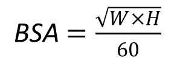

# Exercise Sheet 1

1. Look at the following code fragments. Each one has one small problem that will cause an error or give the wrong output. Using what you know about python math operations and SIPO programming to identify an correct the problems.

a)
```python
distance_km = int(input('Enter a distance in kilometers: ')
distance_km * 1.6 = distance_miles
print(distance_km,'kilometers is the same as', distance_miles, 'miles')
```

b)
```python
distance = duration * speed
speed = int(input('Enter the speed in km: '))
duration = int(input('Enter the duration of time in hours: '))
print(distance)
```

c)

```python
name = input('Enter your name: ') 
print('Hello name')
```

2. Write a program that calculates the annual compound interest on an investment in a bank account. The program will get as input the starting account balance, the interest rate on the account, and the number of years for the money to grow. It will calculate the compound interest assuming that the rate is compounded annually. The equation for compound interest is:


```plaintext
A = P(1 + r/n)^nt

A = final balance   
P = starting balance
r = interest rate (remember this needs to be a percentage)
n = number of times interest applied per time period (use n = 1)
t = the time in years
```

3. Write a program that calculates the total surface area of your skin. This program will take in the users height and weight in inches and pounds. You will need to know that 1 in = 2.54 cm and that 1 kg = 2.2 lbs. It will then convert those value to cm and kg before applying the following equation:

    

    where,

```
    BSA = body surface area
    W= weight in kg
    H= height in cm
```
*Note that even though is uses the height in cm the result is in meters squared.

To solve this equation, you will need to use the square root operator. You do this by importing the library math and then using the sqrt function. I’ve included a short piece of code here to demonstrate.

```python
import math
num = int(input('Enter a number: ')
root = math.sqrt(num)
print('The square root of', num, 'is', root)
```

4. Look at the following and think about how well the code is written. The program works correctly, so I want you to focus on the clarity of the variable names and the comments included. Look at the [marking guide](https://ttopper.github.io/CPSC128/00_Preparing/14_Marking_scheme/) and think about what grade you would give to this code. Make some notes on the feedback you would give to this student to help them improve their grade.

```python
# annual_income.py
# This program calculates how mush someone maeks


w = float(input('Enter how much you make: '))
h = float(input('Enter your hours: '))

total = w * h * 52

print('You make',total, 'dollars.')
```

