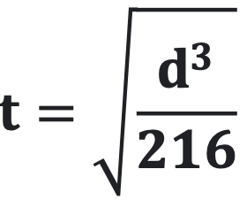
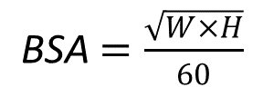

# Exercise Sheet 2

0. Download the program [annual_income.py](70_annual_income.py) and think about how well the code is written. The program works correctly, so I want you to focus on the clarity of the variable names and the comments included. Look at the marking guide provided in the Moodle and think about what grade you would give to this code. Make some notes on the feedback you would give to this student to help them improve their grade.

1. Download the program [animal_sampling.py](70_animal_sampling.py) and try to find all the errors in the code. The code is supposed to take field data from tagged animals in the wild and use it to estimate the total population size. You can try to fix some of the errors before you run the code, or you can run the code and use the error messages generated by python to try and find the problems. In addition to making sure that the code runs without (syntax) errors, make sure that the code gives the correct result (semantic errors).

2. Write a program that calculates the annual compound interest on an investment in a bank account. The program will get as input the starting account balance, the interest rate on the account, and the number of years for the money to grow. It will calculate the compound interest assuming that the rate is compounded annually. The equation for compound interest is:


```plaintext
A = P(1 + r/n)nt

A = final balance   
P = starting balance
r = interest rate (remember this needs to be a percentage)
n = number of times interest applied per time period (use n = 1)
t = the time in years
```


3. Write a program that calculates how long a storm will last based on its diameter in miles.
           
    

    where,

```plaintext
t = time of storm in hours
```

and

```plaintext
d = diameter of the storm in miles
```

To solve this equation, you will need to use the square root operator. You do this by importing the library math and then using the sqrt function. I’ve included a short piece of code here to demonstrate.

```python
import math
num = int(input(‘Enter a number: ‘)
root = math.sqrt(num)
print(‘The square root of’, num, ‘is’, root)
```

4. Write a program that calculates the total surface area of your skin. This program will take in the users height and weight in inches and pounds. You will need to know that 1 in = 2.53 cm and that 1 kg = 2.2 lbs. It will then convert those value to cm and kg before applying the following equation:

    

    where,

```
    BSA = body surface area
    W= weight in kg
    H= height in cm
```

5. Write an equation that asks for the radius of a circle in centimeters (in my example 5 cm) and then prints out the following:

```plaintext
A circle with a radius of 5 cm has a diameter of 10.0 cm,
a circumference 31.41592653589793 cm,
and an area of 78.53981633974483
```
You can get the value of pi by importing the math library again and using math.pi
Here are all the equations you’ll need for the diameter (D) 𝐃 = 𝟐𝐫, circumference (C) 𝐂 = 𝟐𝛑𝐫, and Area (A) 𝐀 = 𝛑𝐫<sup>𝟐</sup>.

```python
import math
# this will print pi, but you can also use it in your equations
print(math.pi)
```
