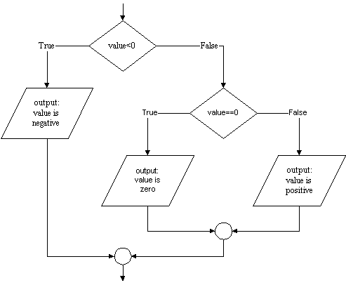

# Correcting an Oversight

The mathematically inclined will examine the previous program and note
that it mishandles the value 0. Which output statement will be executed
if zero is entered? Well, the test `value < 0` will be `False` because 0
is not _less than_ 0, so the first output statement will be skipped, and
the second one will be executed displaying the message

```plaintext
0 is positive
```

on-screen. Unfortunately this is not true: 0 is neither positive nor
negative. This means our program must actually deal with three
possibilities:

1.  The value entered is negative.
2.  The value entered is 0.
3.  The value entered is positive.

We can accomodate this third possibility by modifying our flowchart as
follows.



As the flowchart shows we will require a second selection statement. As
before the first statement will determine if the number is negative. If
it is, the appropriate `print` statement will be executed. If the number
is not negative however, execution will pass to a second `if` statement
that will determine if the value is zero, and then select which of two
further output statements to execute. The corresponding Python code
looks like this:

    value = int(input( "Enter an integer (e.g. 23 or -118): " ))
    if value < 0:
        print(value, "is negative")
    else:
        if value == 0:
            print(value, "is neither positive nor negative")
        else:
            print(value, "is positive")

(Note the double equal signs, ==. More on this below. )

This is a correct Python program, but the situation of a multiway (as
opposed to two-way) decision is so common that Python provides a special
syntax to express it:

    value = int(input( "Enter an integer (e.g, 23 or -118): " ))
    if value < 0:
      print(value, "is negative")
    elif value == 0:
      print(value, "is neither positive nor negative")
    else:
      print(value, "is positive")

Note the use of `elif` which combines `else` and `if` into a single command.
