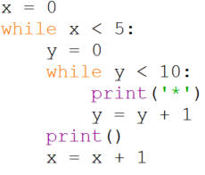

# Nesting loops

This code is an example of nested loops:

The general pattern here is,

<pre>    <b>while</b> <i>test1</i> <b>:</b>
        <b>while</b> <i>test2</i> <b>:</b>
            <i>statement</i>
</pre>
The key thing to be aware of is that the inner `while` loop (the one
with _test2_ does **all** of its iterations for **each** of the
iterations of the outer `while` loop (the one with _test1_).

Note that there is no limitation that stops us at two `while` loops. For
example it is quite common in image processing operations to have four
nested loops. An outer pair that is responsible for considering each
pixel in the image, and an inner pair that processes that pixel in the
context of its neighbouring pixels.
