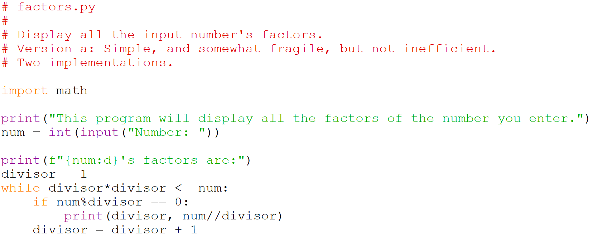

# Factors

Write a program that inputs a positive whole number, and displays all the number's factors, i.e. all the numbers that divide into it exactly. For instance if the number 12 is input, the values 1, 2, 3, 4, 6, and 12 should be output.

## Solutions:

