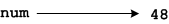
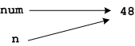

# Writing functions: `is_even()`

We've used several of Python's built-in functions, but how do we write
our own? This is most easily shown by example, so to be concrete let's
suppose we want a function that tells us if a number is even.

It's usually easiest to write a function by starting with how you want
to use it. Let's say we are working on a game and wish we could write,

```python
num = random.randint(0,100)
if is_even(num):
print("Good news your magic number is even! 10 bonus points for you.")
else:
print("Bad news, your magic number is odd.")
```

The good thing about specifying the use of our function before writing
it is that now we know,

-   what the _name_ of the function should be: `is_even`,
-   that it will take one _parameter_ `num` in our case,
-   that it _returns_ a Boolean value, i.e.
    either `True` or `False`.

So we know its name, parameter and return type, and we know from
previous experience how to implement its core functionality:

```python
if n % 2 == 0:
# It's even
else:
# It's odd
```
All we need now is to tie these things together with the necessary
syntax like this,

```python
import random

def is_even(n):
if n % 2 == 0:
    return True
else:
    return False
    
num = random.randint(0,100)

if is_even(num):
print("Good news your magic number is even! 10 bonus points for you.")
else:
print("Bad news, your magic number is odd.")
```
Notes:

-   The keyword `def` marks the begining of a function definition. It is
    followed by the name of the function, the parameter list enclosed in
    parentheses, and a colon.
-   The code to be executed when the function is called is indented
    after the definition line.
-   The `return` statement terminates the execution of the function as
    soon as it is executed and returns the specified value
    (either `True` or `False` above). As you can see above a single
    function may have more than one return statement.
-   The names of the parameter in the program and in the function do not
    need to be the same. `num` in the program is referred to as `n` in
    the function.

You may wonder looking at the code above what we have gained. After all
we have removed `num%2 == 0` from an `if` test and replaced it with 5
lines of code — this hardly seems simpler! What you can't see in the
example above (but will a few examples into the future) is that this new
function can be reused easily in other programs.

This speaks to why the names of the parameters do not need to be the same
in the function and the program — if they did the function could not
be easily reused! Imagine if the built-in square root function could
only be used if the variable it was passed was named `x`. That's not
very reusable.

Instead the name in the function definition line is _aliased_ to the
value named in the call to the function. We can picture memory looking
like this before the function is called,



Like this while the function is executing (see how `n` the name of the
parameter in the function is an alias for the value of `num` the name of
48 in the program?),



And like this again after the function has terminated,


Note that the value of `num` was not changed by the function and this is
as it should be. We don't want a function that decides if a number is
even to change the number in the course of deciding.

Note also that functions do not leave any lasting trace in memory. When
the function terminates, any memory it has been using is freed and
returned to the system. This can lead to a third benefit of functions.
In some types of programs they reduce memory consumption because memory
is only allocated while it is needed, whereas normal variables exist for
the entire run of the program (or at least from the time they are
created until the end of the program).
