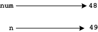

# The Perils of Mutability[^*]

*This is another technical issue, but like scope you're going to bump into it at some point, and we'd better see it before you do. As with scope, if it doesn't make perfect sense on first reading make a mental note of it, and come back to it when you suspect you are bumping into it hard.*

## Immutability

Consider the function increment below. What do you suppose it does? Try running the code below to see if your guess is correct.

```python
# increment.py
def increment(n):
n = n + 1

num = 48
increment( num )
print(num)
```

Most students expect the value 49 to be printed and are surprised when 48 is instead. After all it looks as though `increment` should, well, increment the value it is passed and since it was passed 48 it should have incremented it to 49 and printing `num` should display this value. The programmer might even have intended this, but has been foiled by the fact that in Python, numbers, like strings, are _immutable_.

When `increment` begins to run we can picture memory looking like this,


Now what happens when the line `n = n + 1` is executed? The processor fetches the value that `n` names, i.e. 48, adds one to it to get 49 and then stores this new value with the name `n`. Memory now looks like this,



Why doesn't it look like this?


Because numbers are immutable, so the 48 can't be changed into 49 or into anything else for that matter. Instead a new value, 49, is created and assigned to the name `n`, and this doesn't affect the value referred to by the name `num`.

### Aside

If you want an increment function you would write and use it slightly differently:

```python
def increment(n):
return n+1
num = 48
num = increment(num)
print(num)
```

Try it and see.

## Mutability

Unlike numbers and strings, lists are mutable so they can be affected
when passed to functions, e.g.

```python
def increment(seq):
seq.append(42)

lst = [48]
increment( lst )
print(lst)
```
What result do you expect this to produce? Try it to see if you're
right.

The mutability of lists can surprise us even without invoking a
function. Consider this code fragment. Make your prediction then run it
to see if you're right,

```python
l = [ 'Tim' ]
n = l
l.append( 'Joyce' )
print(l)
print(n)
```
Things can get trickier. Try your predictive abilities on this,

```python
a = 'Tim'
b = 'Tom'
lst = [b, a]
a = 'Matt'
lst[1] = lst[0]
print(lst)
```
---

[^*]: Neither mutable nor immutable values behave the way most students
expect, but mutability trips them up more often than immutability so the
page is named for the more dangerous case.
