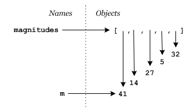

# Using versus changing a list

Reference semantics provides some insight into the different approaches needed to _use_ and to _change_ a list.

## Using a list

First consider the case where you just want to use the values in a list. Perhaps they represent the lengths of bars to draw, e.g.

```
magnitudes = [41, 14, 27, 5, 32]
for m in magnitudes:
    print(m*'=')
```

This works nicely producing the output,

```
>>> magnitudes = [41, 14, 27, 5, 32]
>>> for m in magnitudes:
    print(m*'=')

=========================================
==============
===========================
=====
================================
>>>
```

## Changing a list

### What doesn't work

Now suppose we want to add 10% to each value in the list. We might reason that in the for loop above `m` takes the value of each entry in the list, so changing it will change the values in the list and so try to do what we want like this,

```
for m in magnitudes:
    m = m + m//10
```

but testing will reveal that it doesn't do what we want,

```
>>> magnitudes = [41, 14, 27, 5, 32]
>>> for m in magnitudes:
    m = m + m//10
>>> print(magnitudes)
[41, 14, 27, 5, 32]
>>>
```

because the list is unchanged. Have you already spotted the problem? The first part of our thinking that "m takes on the value of each entry in the list" was correct. The problem is with our second part "changing it will change the values in the list". Here's what memory looks like at the start of the first iteration of the loop and after the assignment statement inside has executed,

|  |
| :---: |
| `for m in magnitudes:` |  |
| `m = m + m//10` |  |




Notice carefully what happened. The expression `m + m//10` was evaluated 41 + 41//10 → 41 + 4 → 45 yielding the object 45, so the name `m` was set to refer to this object (remember: "Assignment creates a reference to an object"!) leaving the list unchanged.

### What works 1

There are a number of ways to get around this problem. The most general* is to access the list contents by index,

```
for i in range( len(magnitudes )):
    magnitudes[i] = magnitudes[i] + magnitudes[i]//10
```

and testing shows it works,

```
>>> for i in range( len(magnitudes )):
    magnitudes[i] = magnitudes[i] + magnitudes[i]//10
>>> print(magnitudes)
[45, 15, 29, 5, 35]
>>>
```

But why does it work? Because the assignment statement on the first iteration becomes `magnitudes[0] = magnitudes[0] + magnitudes[0]//10`. And `magnitudes[0]` is the precise name of the reference that is the first entry in the list so we are changing it directly. Similarly on the later iterations we will change `magnitudes[1]`, `magnitudes[2]` and so on. Remember that the entries in `magnitudes` do have indirect names!

### What works 2

Another approach is to create a new list with the modified values and then assign it to the old name, e.g.

```
tmp = []
for m in magnitudes:
    tmp.append(m + m//10)
magnitudes = tmp
```

### Other things that work

For more Pythonic approaches to the problem consult the last 3 sections of this module.

## Summary

When working with lists be clear in your own mind whether you
are_using_the elements in the list, or_modifying_them and choose
your coding approach accordingly.

For_use_

    for item in thelist:
        # do stuff with item

For_modification_

    for i in range( len(thelist) ):
        thelist[i] = ...

------------------------------------------------------------------------

* Most general because it can be done across many languages. Some would
also say it is the least "Pythonic", but it's still the first one for
us to consider because the aim of this course is to teach programming
not just Python.
