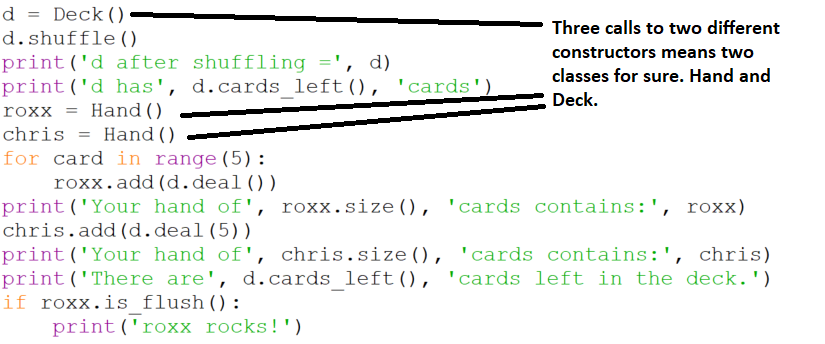

# Identifying the necessary classes

We can learn a lot about what code we have to write by carefully
examining our specification code. First let's look for calls to
constructors. The form of a constructor is that it uses a class name as
a function. We've seen examples of this with Python's built-in
classes, e.g.

```plaintext
    >>> num = int(43.72)
    >>> num
    43
    >>> lst = list('Tim')
    >>> lst
    ['T', 'i', 'm']
    >>>
```

Now we want to look for similar syntax in our specification code,



Doing so reveals that two classes are explicitly referred to in our
specification, one called `Hand` and another called `Deck`.
