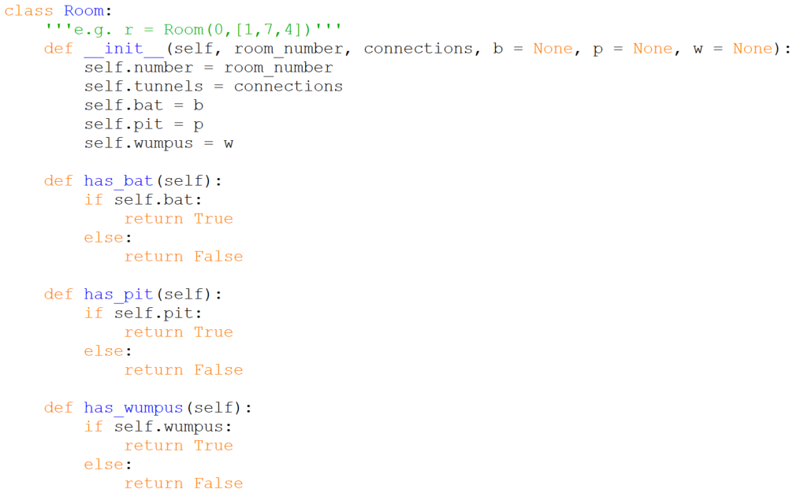
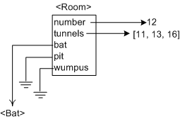
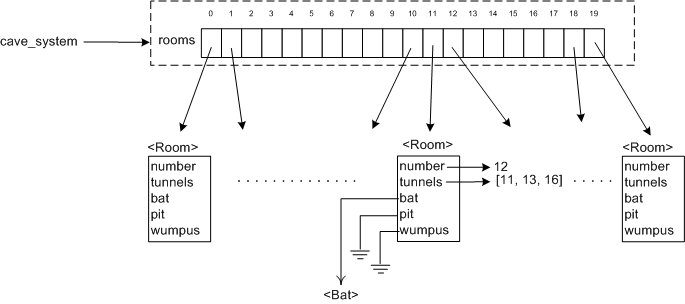

# `class Room`

Rooms have the attributes and methods we identified in our first
pass _plus_ the methods we have shifted from `Cave_System`s to `Room`s:

-   Attributes: **3 tunnels**, possibly **a bat**, possibly **a pit**,
    possibly **a wumpus**.
-   Methods: Should be able to tell us if it **has a bat**, **has a
    pit**, or **has a wumpus,**\
   _plus_
    should be able to tell us **where you can go from here**/what
    rooms are connected to this one; if a room **has a bat**; if a
    room **has a pit**; if the **player is in** a room.

Note the duplication in the methods
list `has a bat` and `has a pit` appears twice! That means that in our
first pass we had assigned two classes responsibility for answering that
question. It's almost always better to have one class responsible for
each action, so this revision already looks like an improvement.

But not perfect. In our pseudocode we ask the player for its location
repeatedly (look for the references to `player.location`). Note that we
don't ask a room if a player is in it, we ask the player. So we'll
remove that method from class `Room`, leaving us with,

-   Attributes: **3 tunnels**, possibly **a bat**, possibly **a pit**,
    possibly **a wumpus**.
-   Methods: Should be able to tell us **where you can go from
    here** (what rooms are connected to this one) and if it **has a
    bat**, **has a pit**, or **has a wumpus**.

In Python we get,

Notes:

-   We will identify rooms by their number as shown in MAP previously.
-   `connections` here is a list of rooms connected by tunnels to this
    one, e.g. `[1, 7, 4]` meaning this room is connected to room number
    1, room number 7, and room number 4.
-   By default a room does not have a bat, pit or wumpus
    (`b=None, p=None, w=None`). These will be sprinkled around the cave
    system later.
-   The `has_...` methods that answer questions look to see if the
    relevant attribute is defined and if it is, returns `True`,
    otherwise `False`.

In memory a single Room object can be pictured like this (for room 12
which connects to rooms 11, 13 and 16, and has a Bat but no Pit or
Wumpus),

and an entire cave system can be pictured as (with most rooms left out
and only the details for room 12 shown),

The remaining classes are relatively straightforward compared to these
first two.
