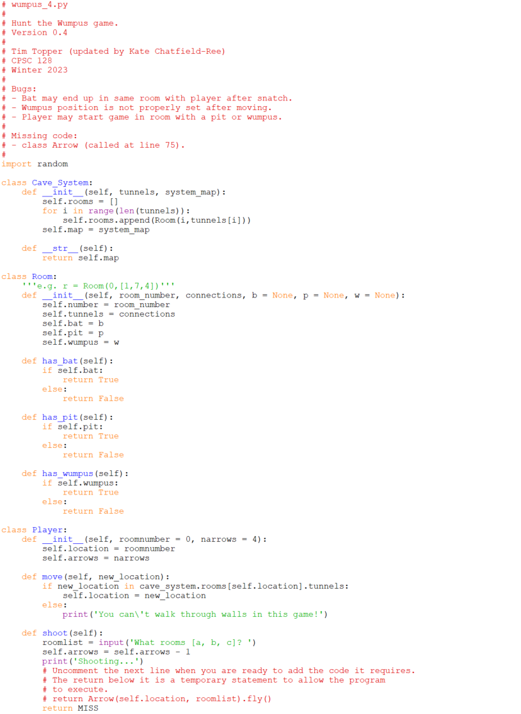
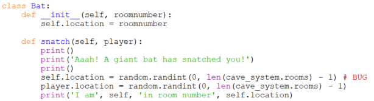
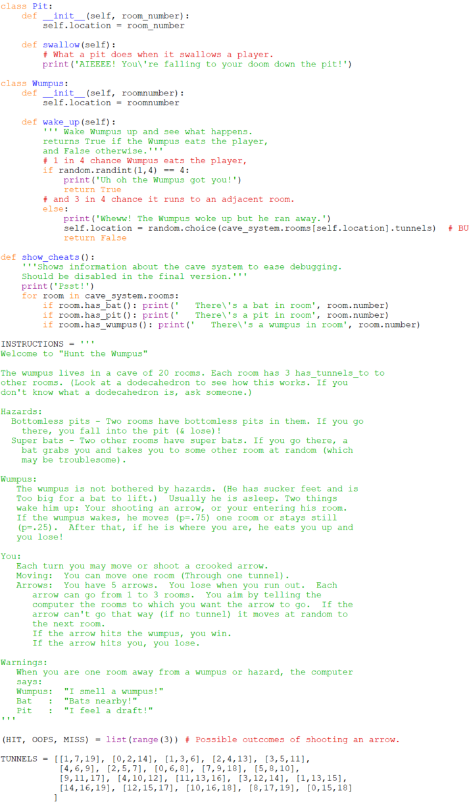
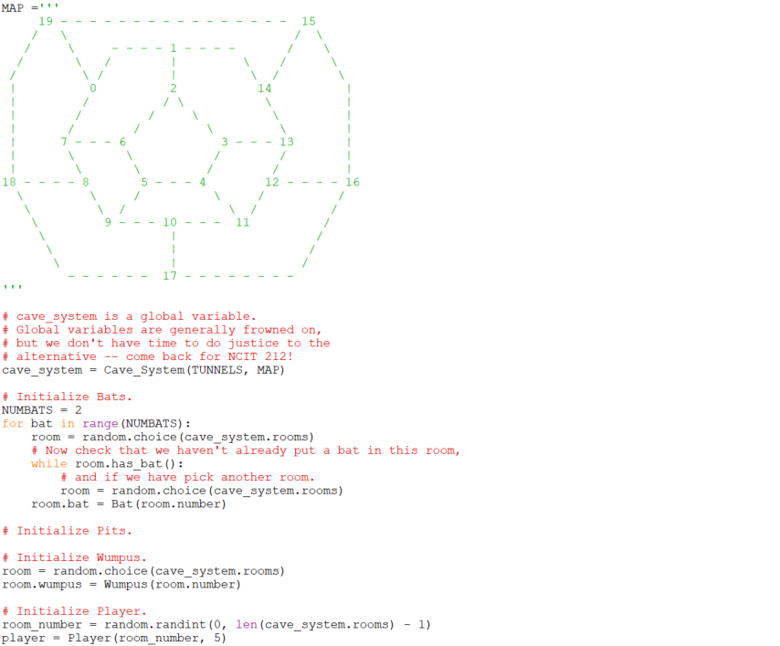
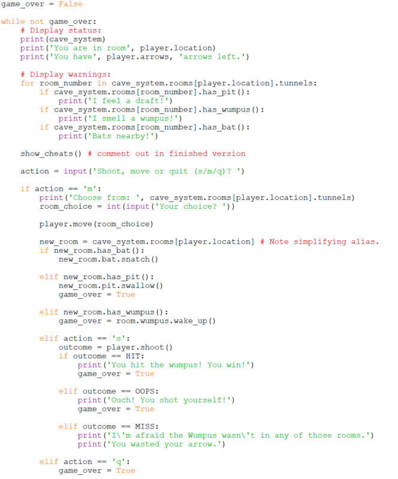

# Putting the pieces together

If you gather together the pieces we have written so far, and add a
little glue code to the main routine, you have a program that will run.

This is the longest program in the course so take some time to read it
over. You'll notice that there is:

-   some new code (whose details I'll explain),
-   some bugs (that you'll be correcting as part of the assignment!),
    and
-   a few pieces that are missing (that you'll be adding as part of the
    assignment).
