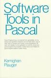

# Course Philosophy

I think Kernighan and Plauger nailed it on the cover of their seminal
book Software Tools in Pascal[*](#L833):

The fine print in the image says:

> Good programming is not learned from generalities, but by seeing how
> significant programs can be made clean, easy to read, easy to maintain
> and modify, human-engineered, efficient, and reliable, by the
> application of common sense and good programming practices. Careful
> study and imitation of good programs leads to better writing.

This has certainly been true for me, and most of the students I have
taught. Accordingly this course is designed around modelling and
practice. I model for you how to write programs either by describing it
on web pages or, when something is better shown than told, showing you
in video screencasts. In many modules additional example programs are
provided for you to study. Finally, the assignments (with the exception
of the first introductory module) all aim to get you writing code in a
careful sequence that will take you in stages from writing simplistic
programs to writing subtle and powerful ones.

[*]{#L833} Kernighan, Brian W. and P. J. Plauger <em>Software Tools inPascal</em>, Reading, Massachusetts: Addison-Wesley, 1981.