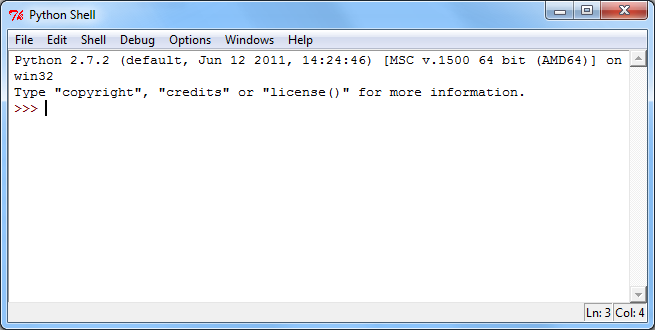

# Installing Python

Here are some brief guidelines for installing Python. They have been
sufficient for most students to get it installed, but don't hesitate to
let me know if you get stuck or are uncertain about how to proceed at
some point in the process.

*Version*: We will be using Python 2.x where x needs to be 4 or greater.
2.7.9 is the newest version as of Jan 2015.

**Do not install Python 3.x!** Yes it is newer and improved, but it is
still *too new*. Many of the online resources you will find describe the
2.x series so that is what we will use. As python.org itself puts it,

> "\...start with Python 2.7; more existing third party software is
> compatible with Python 2 than Python 3 right now."

*Windows users*: Go to the [Python download
page](http://www.python.org/download) and select "Python 2.7.9". This
will download an MSI file that you can then execute to install Python.

*Macintosh users*: Python comes pre-installed on Mac OS X but may not
include a graphical development environment. Check the Python.org page
[Python on the Mac](http://www.python.org/download/mac/) for more
information.

*Linux users*: If you are using a Linux system you probably already have
Python installed. Check your menus and see. If you don't see an entry
for Python, try typing `which python` at a shell prompt. If you get back
a path, e.g. `/usr/bin/python`, it means Python is installed and you're
good to go. If not, use your package manager to install Python 2.x. (If
you don't know what your package manager is, or what a shell prompt is,
you might not be ready for Linux).

## Testing your installation

You can run Python at an unadorned command line or in a more helpful GUI
(**G**raphical **U**ser **I**nterface) environment. The standard Python
GUI is called IDLE, and is what I will describe using throughout the
course. (If you have some programming experience or just like trying
software out there are numerous other more powerful Pyton IDEs you can
explore. Let the Google guide you!)

If you run IDLE you will get a window that looks something like this
(allowing for OS and version differences, and probably larger---I scaled
it down a bit to keep the image compact),

You can check that Python is working by typing a couple of commands.
First type: `print "Hello Python"` and then press the Enter key. Then
try typing: `print 2**16` and pressing Enter. If you see this,

it's working! And you've learned your first Python statement: `print`.

If you don't see that, get in touch, and we'll sort things out.
