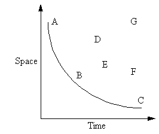

# Big Picture 1: Computer Science

Let's start with this quote from an eminent computer scientist:

> Computer Science is no more about computers than astronomy is about
> telescopes.
>
> — Edsger W. Dijkstra

Surprised? Dijkstra is saying that the real study of computer science is
not computers, but something else, and that computers are merely the
tools computer scientists use to study this something else, in the same
way that astronomers use telescopes to study the stars and planets.

**Q:** What could this something else be?

**A:** Computation! If we could redo history knowing what we do now, we
would have made sure the field was called *computational science* not
computer science.

**Q:** Well, what on earth would the goals of a science of computation
be?

**A:** To determine *what* can be computed and *how* it can best be
computed.

**Q:** But what exactly does *computed* mean?

**Q:** By *computed* we mean the manipulation of data by a computational
procedure. We will be studying the class of computational procedures
called algorithms. Algorithms are computational procedures that are
guaranteed to work, i.e. find the correct answer, and to do so in a
finite amount of time.

(You might wonder what good a procedure that doesn't work might be, and
well you might. The answer is that in some problem areas it is more
important to have a quick answer that is close enough, than to take a
long time to get an exact answer. Computational procedures that do not
guarantee the correct/most accurate answer, but do usually produce good
answers, are called heuristics.)

**A:** What about the meaning of *best* up above?

**A:** By *best* we mean the algorithm that makes the most efficient use
of our computational resources.

**Q:** But what are our *computational resources*?

**A:** At its heart a computer can be thought of as a processor
(surprisingly similar to your hand calculator), strapped to a bank of
memory. So the *resources* we have are the time of that processor, and
the space in the memory bank. The "best" algorithm is the one that
finds the answer or completes the computations using the least amount of
processor time and the least amount of memory. One of the core interests
of the field of computer science is the search for ever better
algorithms.

**Q:** How good are the algorithms they have developed?

**A:** That varies greatly. In a few areas computer scientists have been
able to prove mathematically that they have indeed found the best
possible algorithm. In other areas no useful algorithm is known. And the
rest of the field lies between those extremes with much of it wide open.

There is another subtlety to be aware of when discussing the quality of
algorithms: it is helpful to identify the computational resources to be
used efficiently (processor time and memory space), but that alone
isn't enough to identify the best algorithm.

Consider an algorithm that uses 1 unit of time and 10 units of storage,
and another that uses 10 units of time and 1 unit of storage. Which is
best? The answer depends on what you have the most of in any particular
application, or on the real-world demands placed on the solution, e.g.
the importance of timeliness versus the "costs" of memory.

In fact computer scientists do not generally discuss a single best
algorithm, but instead talk about the envelope of solutions to a
particular class of problems.

The graph below plots the time and space required by alternative
solutions to a particular problem. On these axes the best possible
algorithm would be plotted at the origin, i.e. it would take no time and
no memory to compute the answer. Notice that the fastest algorithm is A,
the smallest is C, and B represents some sort of middle ground in the
space. The other algorithms are less attractive. We can draw a curve
through A, B, and C that represents the leading edge of what is
possible. This curve is sometimes referred to as the "envelope", and
computer scientists talk about pushing the envelope: finding algorithms
that push this boundary downward closer to the origin.

