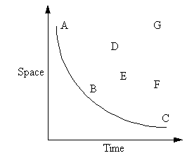

# Big Picture 1: Computer Science

Let's start with this quote from an eminent computer scientist:

> Computer Science is no more about computers than astronomy is about telescopes. — Edsger W. Dijkstra

Surprised? Dijkstra is saying that the real study of computer science is not computers, but something else, and that computers are merely the tools computer scientists use to study this something else, in the same way that astronomers use telescopes to study the stars and planets.

**Q:** What could this something else be?

**A:** Computation! If we could redo history knowing what we do now, we would have made sure the field was called _computational science_ not computer science.

**Q:** Well, what on earth would the goals of a science of computation be?

**A:** To determine _what_ can be computed and _how_ it can best be computed.

**Q:** But what exactly does _computed_ mean?

**Q:** By _computed_ we mean the manipulation of data by a computational procedure. We will be studying the class of computational procedures called algorithms. Algorithms are computational procedures that are guaranteed to work, i.e. find the correct answer, and to do so in a finite amount of time.

(You might wonder what good a procedure that doesn't work might be, and well you might. The answer is that in some problem areas it is more important to have a quick answer that is close enough, than to take a long time to get an exact answer. Computational procedures that do not guarantee the correct/most accurate answer, but do usually produce good answers, are called heuristics.)

**A:** What about the meaning of _best_ up above?

**A:** By _best_ we mean the algorithm that makes the most efficient use of our computational resources.

**Q:** But what are our _computational resources_?

**A:** At its heart a computer can be thought of as a processor (surprisingly similar to your hand calculator), strapped to a bank of memory. So the _resources_ we have are the time of that processor, and the space in the memory bank. The "best" algorithm is the one that finds the answer or completes the computations using the least amount of processor time and the least amount of memory. One of the core interests of the field of computer science is the search for ever better algorithms.

**Q:** How good are the algorithms they have developed?

**A:** That varies greatly. In a few areas computer scientists have been able to prove mathematically that they have indeed found the best possible algorithm. In other areas no useful algorithm is known. And the rest of the field lies between those extremes with much of it wide open.

There is another subtlety to be aware of when discussing the quality of algorithms: it is helpful to identify the computational resources to be used efficiently (processor time and memory space), but that alone isn't enough to identify the best algorithm.

Consider an algorithm that uses 1 unit of time and 10 units of storage, and another that uses 10 units of time and 1 unit of storage. Which is best? The answer depends on what you have the most of in any particular application, or on the real-world demands placed on the solution, e.g. the importance of timeliness versus the "costs" of memory.

In fact computer scientists do not generally discuss a single best algorithm, but instead talk about the envelope of solutions to a particular class of problems.

The graph below plots the time and space required by alternative solutions to a particular problem. On these axes the best possible algorithm would be plotted at the origin, i.e. it would take no time and no memory to compute the answer. Notice that the fastest algorithm is A, the smallest is C, and B represents some sort of middle ground in the space. The other algorithms are less attractive. We can draw a curve through A, B, and C that represents the leading edge of what is possible. This curve is sometimes referred to as the "envelope", and computer scientists talk about pushing the envelope: finding algorithms that push this boundary downward closer to the origin.

