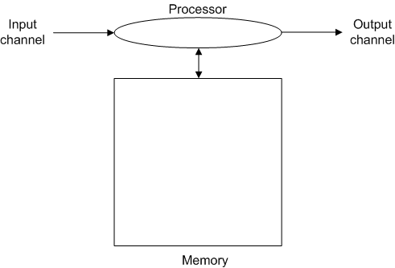

# The World of the Computer: Six (+1) Key Programming Concepts

> *Most programmers (and by most, I mean the overwhelming majority) use
> imperative programming techniques that would have been familiar to
> their distant ancestors in the 1970s. Those techniques may be wrapped
> up in objects, but still basically push bits around using assignment,
> indexing, loops, conditionals, and function calls.* —  [Greg
> Wilson](http://pyre.third-bit.com/blog/not-on-the-shelves)

There are just six crucial programming operations. These six are
sufficient to express any computation in any
field^[*](https://www.timtopper.com/CPSC128.W15/M01_Introduction/05_TheWorldOfTheComputer.html#L88)^,
whether it is a scientific calculation, altering the pixels in an image,
transmitting a file across a network, compiling a report from a
database, or triggering the iginition in a car. Since these operations
are instructions to the computer to do things we first need a model of a
computer. Here's one sufficient to understand most of the programming
we will do in this course.

It doesn't look very much like the computer in front of you. There is
no monitor, no keyboard, no mouse, no system unit. That's because it is
a functional diagram of a computer not a physical diagram, and from a
programming point of view, *from the computer's point of view,* this is
all there is to a computer. In fact this is all there is to any
computer. They all share these components.

-   a processor that manipulates data, usually confined to very simple
    arithmetic (think addition, multiplication) and logical (think
    oflight switches controlling lights) operations.

-   a block of memory to store values created during processing. This
    can vary in size from a few bytes for dedicated processors to
    gigabytes on large servers.

-   an input channel used to load values into the processor. Your
    keyboard, mouse, microphone, network all feed into the input
    channel.

-   an output channel that can be used to emit values from the processor
    or memory. Your screen, speakers and network connection are fed by
    the output channel.

The six operations consist of three elementary operations:

-   input

-   processing, and

-   output

and three control structures,

-   sequence

-   selection, and

-   repetition
