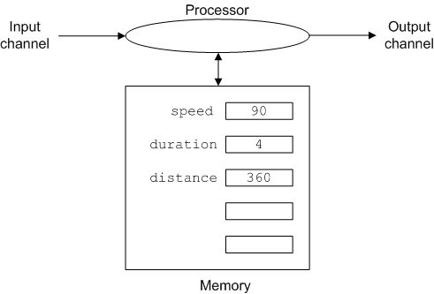

# Operation #2: Processing

Once we have the necessary data in memory we "process" it. Processing
refers to the manipulation of data stored in memory. Most procedural
languages use an assignment statement to specify the processing to be
performed. The form of an assignment statement
is: *name* = *expression*. The assignment statement instructs the
computer to calculate the value of *expression* and to store the result
and label it *name*. Here's an example in Python,

    distance = duration * speed  

This statement causes the processor to retrieve the values
of `duration` and `speed` from memory, multiply them, store the result
in memory and label it `distance`. The effect on the state of the
computer is shown below.

That assignment statement looks a lot like a mathematical equation. This
is a holdover from one of the earliest programming languages FORTRAN
(short for FORmula TRANslator), and is both a blessing and a curse. It
is a blessing because most people have some experience with equations,
and assignment statements are a lot like equations. It is a curse
because they are not *exactly* like equations.

The first unimportant difference is that the statement above uses an
asterisk to specify multiplication where we are used to using a times
symbol, ×, that looks like an x. However most computer languages can't
use an x for multiplication because x could be a name, and computers
don't have an easy way to tell which x's in your program mean perform
a multiplication and which ones are names. To avoid confusion an
entirely different symbol, `*`, is used for multiplication. This is not
Python-specific all the mainstream languages use the `*` for
multiplication. In fact humans don't really use x for both
multiplication and names, we just think we do because of the limited
choices on our computer keyboard. When we write with a more flexible
tool though, like a pen on paper, we usually use *x* as a name and × for
multiplication. The other basic operators are the ones you are used to:

-   `+` for addition
-   `-` for subtraction
-   `/` for division

The other basic operation is exponentiation or informally "powers".
When we do math on paper we write 2^3^ for "two cubed" or 2 × 2 × 2
but early programming languages had no easy way to type a superscript
and so adopted other notations. Python uses `**` for exponentiation
so `2**3` for two-cubed (the other common choice in programming
languages is \^ or 2\^3). The pair of asterisks is to remind us of
repeated multiplication.

The fact that assignment statements look a bit like equations, has
prompted many people to refer to the names of memory locations
(i.e. `rate`, `duration` and `distance`) as *variables*, and programmers
do this too. It's not inaccurate since the same name can refer to
different values at different times in the life of a program. But it is
crucial to remember that assignment statements are *not* equations. To
emphasize this consider the following example,

    x = x + 1

Depending on how long it's been since you thought about equations
carefully this may not look odd at first, but mathematically it is
nonsense because there is no number that is equal to itself plus 1!

It is however perfectly valid and sensible Python. Here's how the
computer interprets it.

> Fetch the value of x from memory, add 1 to it, and then store the
> result back in memory labelling the new value x.

So in Python this assignment statement says to increment the value of x
by 1. The key here is that assignment statements should be read from
right to left. Remember the form of the assignment statement
was: *name* = *expression*. The expression on the right is evaluated and
the result stored using the name on the left. Note that the expression
is always on the right and the name always on the left. While it is ok
to write `x = x + 1` Python will complain and generate an error message
if you write `x + 1 = x`. Try it in IDLE and see.
