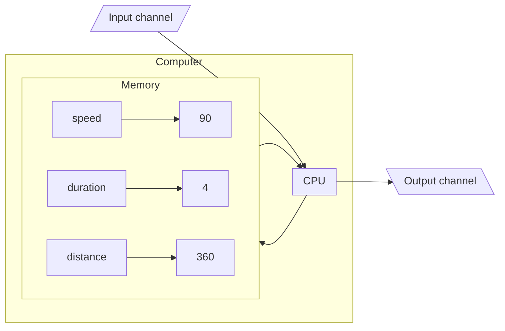

```mermaid
flowchart LR
    subgraph Computer
        direction TB
        subgraph CPU
            direction TB
        end
        subgraph Memory
            direction LR
            s[speed] --> n1[90]
            d[duration] --> n2[4]
            di[distance] --> n3[360]
        end
        CPU --> Memory
        Memory --> CPU
    end
    I[/Input channel/]
    O[\Output channel\]
    I --> CPU
    CPU --> O
```