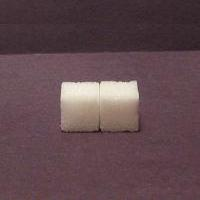
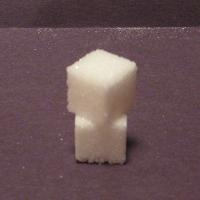
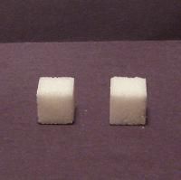
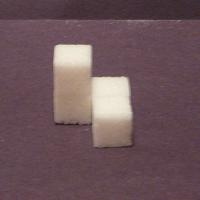
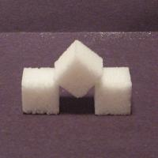

# Assignment 1

## Part I: Short Answer Questions

This part of the assignment is a crude and blatant attempt to check that
you have read over the course information materials, but I hope that
writing the answers down will help you to remember some key points from
the material in this module. I am not looking for creativity in the
answers: feel free to cut and paste from the course notes. In fact, you
could think of it as a scavenger hunt for answers in the notes.

1.  How much are the assignments in the course worth?

2.  Which of the examinable topics means the least to you right now?

3.  What should computer science really be called?

4.  What are our two key computational resources?

5.  What does the "envelope of algorithm performance" refer to?

6.  What is a computer program?

7.  What is an algorithm?

8.  List the key operations imperative programming relies on.

9.  What are the four functional components of a computer?

10. How many keywords are there in Python?

## Part II: Installing the Python Shell

If you want to use Python on your own computer here is the link to
download and install it: <https://www.python.org/downloads/>

## Part III: Using the Python Shell

Provide the transcript of your Python shell session (including the
output!) after you have used the Python shell to:

-   Display the value of 2^100^.

-   Calculate the volume of a sphere of radius 2.0 metres. (The formula
    for the volume of a sphere is 4ϖ*r*^3^/3.)

-   Display the square root of 2.

-   Run the following code:

> \>\>\> if 10**20 \> 20**10:
>
> print('10**20 wins!')
>
> else:
>
> print('20**10 wins!')

-   Run the following code:

> \>\>\> n = 1000000
>
> \>\>\> size = 0
>
> \>\>\> while n \> 1:
>
> n = n // 2
>
> size = size + 1
>
> \>\>\> print('1000000 is approximately 2**', size)

-   Run the following code:

> \>\>\> for c in 'Kate':
>
> print(c)

## Part IV: Writing Algorithms

To get some practice specifying algorithms write instructions to enable
someone to recreate each of the sugar cube structures pictured below.
(To mark this question, I will try and follow your instructions
precisely and see how closely the result matches the goal. You might
want to give the instructions to a friend and see what they construct
before submitting them to me.)

(i) (ii)

(iii)
(iv)

(v)

## Part V: Trading off Processors and Memory

In [Big Picture 1: Computer
Science](01-big-picture-1-computer-science.md) you
read that algorithms are ranked according to how much space and time (or
memory and processing) they use with the goal being to use as little of
each as possible. The flipside is that most problems can be solved more
quickly the more of each of those resources you have available. We'll
demonstrate this in the following exercise (and we'll share our data to
confirm it across trials, and perhaps get our competitive juices going).
We're going to compare the time it takes to complete some processing
depending on how many processors and how much memory we have.

1.  Get a deck of cards and a stopwatch (if not an actual stopwatch, any
    watch where you can measure time in seconds).

2.  Shuffle the deck of cards.

3.  Time how long it takes you to sort the cards into
    order[[*]] using
    your hands and a table top (i.e. you can spread the cards out or
    stack them anyway you want on the table top).

4.  Get three friends and shuffle the deck and time how long it takes
    the four of you to sort the cards using the tabletop. Give some
    thought to how you should organize your efforts. (How you do this
    represents your algorithm.) You might want to do multiple timings
    here because you will probably be faster the second and third times
    than the first. After a couple of attempts the rate of your
    improvement will probably decrease (and you'll be getting bored).

5.  Before your friends flee, shuffle the deck and then time yourselves
    sorting the cards again but without using the table top, i.e. all
    the cards have to be held in your eight hands at all times (no
    placing cards on your kness, head or anywhere else, or holding any
    in your mouth etc. Although the desire to do these things shows you
    just how valuable a little more memory can be.).

6.  Now that your friends have left, shuffle the deck and time yourself
    sorting the deck one last time but this time using only your two
    hands, i.e. no table top! (Or knees etc.)

* We'll use Bridge order where the order of the suits will be
Clubs-Diamonds-Hearts-Spades and the cards within each suit will be
ordered from Ace to King.
