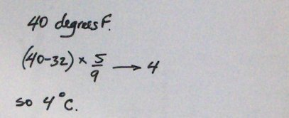

# Do The Problem By Hand

We can't instruct the computer to do something unles we know how to do
it first. So let's begin by doing a temperature conversion by hand.

Here's what I wrote down as I converted 40 degrees Fahrenheit to its
Celsius equivalent.

Here's what I did step by step:

1.  I began by writing down the amount to be converted, 40.

2.  Next I subtracted 32 from it.

3.  Then I multiplied the difference by 5/9.

4.  The result was 4, meaning that 40 degrees Fahrenheit is equivalent
    to 4 degrees Celsius.

The next step is to look at what we did by hand and identify the
corresponding computer commands.
