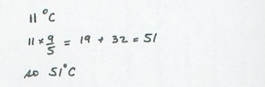

# Our second program (Same as the first only backwards)

Let's write a program to undo the conversion from Fahrenheit to Celsius we did above. It should convert a temperature measurement in Celsius to one in Fahrenheit.

## Do it by hand

As before we begin by doing it by hand.

Suppose I want to convert 11 degrees Celsius to its Fahrenheit equivalent. I would write:

Now we need to look at what we have written, and try to view it in terms of the computer operations: input, processing and output operations.

The input operations gather the necessary information. In this case the only information necessary is the value to convert, i.e. 11.

The processing operations are to take the input value, multiply it by 9/5, and add 32.

The output operation is to display the result, i.e. 51.

## Translate to Python

Translating each of those steps into Python gives us:

    temp_in_c = int(input())
    temp_in_f = temp_in_c * 9/5 + 32
    print(temp_in_f)

This is the computational core of our program, but we need to add
documentation and an interface. By interface we mean that we need to
provide a way for the user to interact with the program. Specifically we
need to give the user some initial instructions, and then some
meaningful output. Adding a minimal set of instructions and pulling all
the pieces together gives us this program.

    # c2f.py -- converts a temperature in Celsius to its equivalent in Fahrenheit.
    # CPSC 128 Example program
    # Kate Chatfield-Reed, Winter 2023

    # Input:
    print "This program converts temperatures from Celsius to Fahrenheit."
    print "Enter a temperature in Celsius (e.g. 10) and press Enter."
    temp_in_c = int(input("Enter temperature in Celsius: "))

    # Processing:
    temp_in_f = temp_in_c * 9/5 + 32

    # Output:
    print(temp_in_c, "degrees Celsius =", temp_in_f, "degrees Fahrenheit.")
