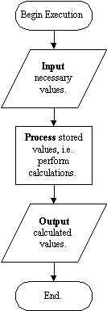

# SIPO Summary

Using input, processing (via assignment), and output statements we can
write sequential or SIPO programs. These programs have a standard
structure containing three parts:

1.  a block of statements to get the necessary input values from the
    user,

2.  a block of statements to process these values (typically to
    calculate new values based on them),

3.  and a block of statements to output the calculated values.

The number of statements in each block will vary, as will the particular
processing operations, but those three fundamental parts will always be
present. This program structure can be represented using a flowchart as
follows:

