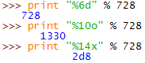
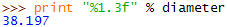
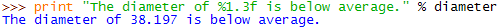
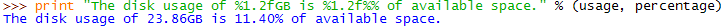

# Output Formatting

To get output like this,


instead of this,


Build a `print` statement with the
string,


[Below is the output of each print
statement.]{style="font-size: 0.9375rem;"}\

1.  \

2.  

3.  \

The formatting codes used in the second print statement are derived from
those originally used by the language C and now also used by the
languages C++, AWK, Perl, and PHP among others. Each format placeholder
has the form,

```plaintext
    %[optional arguments]letter
```

The % sign indicates the beginning of a placeholder.

The letter indicates the desired format:

  Letter  | Format
  :------:|------------------------------
  d       | decimal integer
  o       | unsigned octal integer
  x       | unsigned hexadecimal integer
  f       | floating point
  s       | string
  
All these take an optional argument specifying the width of the field in
which the value should be displayed, e.g.



The floating point code takes an additional argument specifying the
number of digits to display to the right of the decimal point, e.g.


Note that if a field width is narrower than the value to be displayed
the field is enlarged to fit the value, e.g.



this can be helpful when you want to insert numerical values into
sentences (rather than some tabular format), e.g.



If you need to display multiple values enclose the interpolating
variables in parentheses, e.g.



This example also illustrates that to output a literal % character you
need to use a pair of them.

There is much more to string formatting than is shown here. For the
details start with the Python Library Reference [Section
3.6.2](http://www.python.org/doc/current/lib/typesseq-strings.html).
More details can be found in the Gnu AWK manual [Section
4.5](http://www.gnu.org/manual/gawk/gawk.html#Basic-Printf)
