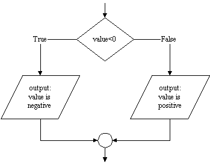

# `if:` A Simple (artificial) Example

Consider the problem of checking a number to see if it is positive or
negative, and outputting an appropriate message. The SIPO statements we
have used so far are not up to the task. The problem is that the message
we output depends on the sign of the variable, and that may change from
one run of the program to the next. That means that both the possible
output statements "is negative" and "is positive" must be present in
the program, and that the program must *select* which one to execute
based on the sign of the variable. Python has a selection statement
called `if` that allows us to do that, like this:

    value = int(input("Enter an integer (e.g, 23 or -118): "))
    if value < 0:
        print(value, "is negative")
    else:
        print(value, " is positive")

(Note that the statements after the `if` and `else` statements are
indented four spaces.)

The first statement should look familiar, but here's what happens next.
The `if` statement says that if `value` is less than 0 then the
first `print` statement should be executed, otherwise ("else") the
second `print` statement should be executed.

Here's how the execution of the statements takes place. When the
program reaches the `if` statement, it evaluates the
expression `value < 0`. If the expression is `True` (the number stored
in `value` is less than zero) it executes the first `print` statement,
and then skips over the `else` and the second `print` statement. On the
other hand, if the expression is `False`, it skips the
first `print` statement and executes the statement after the `else`. The
key is that in either case only one of the `print` statements is
executed, i.e. the `if` statement *selects* which one to execute based
on the *test* `value < 0`.

The flow of control of this `if` statement can be represented using a
flowchart as shown below. Following the arrows (the *flow* so to speak)
from top to bottom makes it clear that on any run of the program only
one of the two output statements will be executed.

