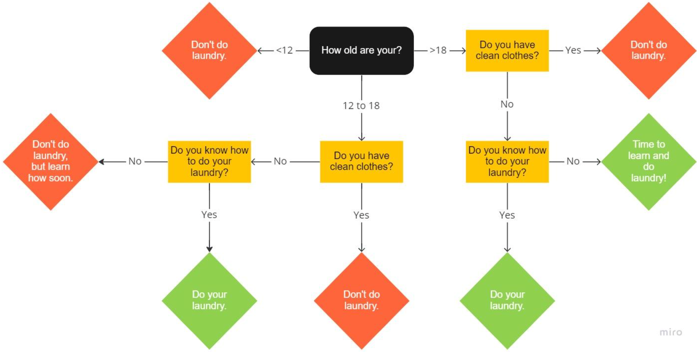

# Assignment 3

## Problems

1.  ### Is it a triangle?

    Write a program that accepts three numerical values and outputs a
    message indicating whether they could represent the lengths of the
    sides of a triangle or not. (Note: Not necessarily a right-angled
    triangle, just any triangle at all.)

    A sample run might look like this,

        =================
        Is it a triangle?
        -----------------
        Enter your first value: 4
        Enter the second value: 9
        Enter the third value: 3
        I'm afraid those three numbers could NOT represent the lengths of the sides of a triangle.

2.  ### Is it an Armstrong number?

    An Armstrong number is an *n*-digit number that is equal to the sum
    of its digits each raised to the *n*th power. For example 153 equals
    1^3^+5^3^+3^3^, so it is an Armstrong number. Write a program that
    inputs a three-digit number, and outputs a message saying whether it
    is an Armstrong number or not.

    A sample run might look like this,

        ==========================
        Is it an Armstrong number?
        --------------------------
        Enter your number: 284
        I'm afraid 284 is NOT an Armstrong number.

    *Hint*: You can pull apart a number to get its individual digits by
    dividing and modulo-ing by appropriate multiples of 10, e.g. num %10
    will give you the 1s digit, i.e. the rightmost digit, and num/100
    will give you the 100s digit, i.e. the leftmost digit.

3.  ### Richter Scale

    Write a program that inputs the Richter magnitude of an earthquake
    and outputs the corresponding description and typical effects
    according to the table* below.

```
      ----------------------- ----------------------- -----------------------
      Richter\                Description             Earthquake Effects
      Magnitudes                                      

      Less than 2.0           Micro                   Microearthquakes, not
                                                      felt.

      2.0-2.9                 Minor                   Generally not felt, but
                                                      recorded.

      3.0-3.9                                         Often felt, but rarely
                                                      causes damage.

      4.0-4.9                 Light                   Noticeable shaking of
                                                      indoor items, rattling
                                                      noises. Significant
                                                      damage unlikely.

      5.0-5.9                 Moderate                Can cause major damage
                                                      to poorly constructed
                                                      buildings over small
                                                      regions. At most slight
                                                      damage to well-designed
                                                      buildings.

      6.0-6.9                 Strong                  Can be destructive in
                                                      areas up to about 160
                                                      kilometres (100 mi)
                                                      across in populated
                                                      areas.

      7.0-7.9                 Major                   Can cause serious
                                                      damage over larger
                                                      areas.

      8.0-8.9                 Great                   Can cause serious
                                                      damage in areas several
                                                      hundred miles across.

      9.0-9.9                                         Devastating in areas
                                                      several thousand miles
                                                      across.

      10.0+                   Epic                    Never recorded; see
                                                      below for equivalent
                                                      seismic energy yield.
      ----------------------- ----------------------- -----------------------
```

    A sample run might look like this,

```
        ======================
        Earthquake Interpreter
        ----------------------
        Enter the Richter magnitude of the earthquake: 4.4
        Magnitude: 4.4
        Description: Light.
        Effects: Noticeable shaking of indoor items, rattling noises. 
        Significant damage unlikely.
```

4.  ### Should I do Laundry?

    Write a program that gets the users age, whether they have clean clothes, and whether they know how to do laundry. From that data the
    program should tell the user if they need to do laundry based on the flow chart below. I’d also like you to add one more question to the flow chart and think about how it might change the decision (something like smell or maybe accessibility issues). I’ve also included a sample
    run (with just the base criteria).

    ```
    ======================
    Should you do Laundry?
    ----------------------
    How old are you? 21
    Do you have clean clothes (y or n)? n
    Do you know how to do laundry (y or n)? y
    Based on your answers it is time to do laundry!
    ```



## Logistics

Use the following naming scheme for your program files:
    `a`*assignment#*`p`*problem#*`v`*version#*`.py` . So your first
    attempt at problem 1 on this assignment will be named `a3p1v1.py`
    and your second attempt (should there be one) will be named
    `a3p1v2.py` .

------------------------------------------------------------------------

* based on one on [the Wikipedia page on the Richter
Scale](http://en.wikipedia.org/wiki/Richter_scale).

** [original
source](http://www.innovationsinnewspapers.com/index.php/2009/02/21/more-design-awards-for-innovations-projects/).
