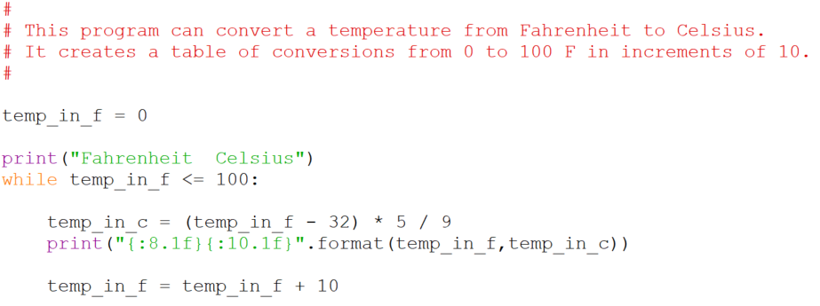

# Problem: Repeating calculations

What if instead of converting one temperature from Fahrenheit to Celsius
we wish to calculate a number of conversions and display a conversion
table? For example:

    Fahrenheit Celsius
         0       -18
        10       -13
        20        -7
        30        -2
        40         4
        50        10
        60        15
        70        21
        80        26
        90        32
       100        37

## Solution:

Note the string formatting I used to make the table display cleanly.
