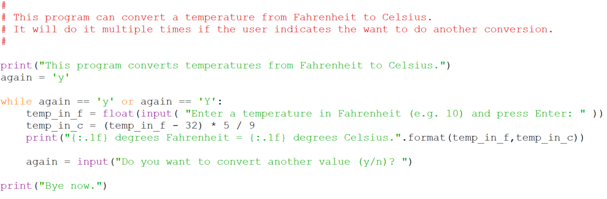

# Repeating a program (without restarting it)

One practical thing the `while` statement enables you to do is to allow
your users to rerun a program without having to restart it, so they can
for example perform a series of conversions without having to restart
the program. The template to do this is,

The trick is that we use a variable called `again` which we initialize
to be the letter `y`. We then test the value of `again` to see if it is
either `y` or `Y`. Obviously this test succeeds the first time because
we have just initialized the value of `again` in the line above. But, at
the bottom of the `while` loop we have a raw_input statement where we
read in a response from the user to a query about whether they would
like to repeat the program. Once they enter their value control goes
back up to the `while` statement where their input is tested. If they
entered a `y` or a `Y` the body of the loop is repeated, but if they
entered anything else the body is skipped, the message `Bye now.` is
displayed, and the program terminates.

## An example

Here is an example of this template being put to work to allow the user
to carry out multiple f2c conversions during one run of a program,

