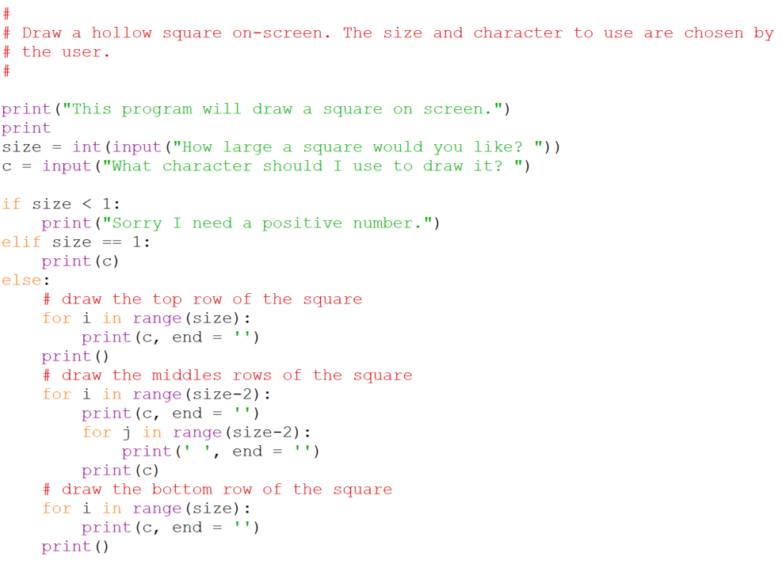
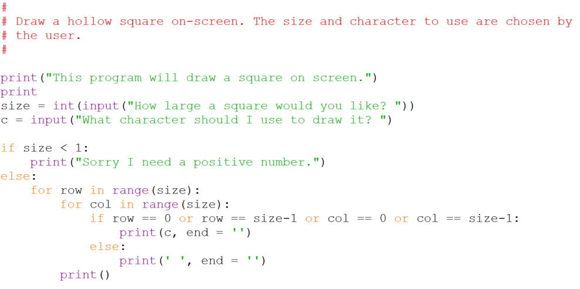
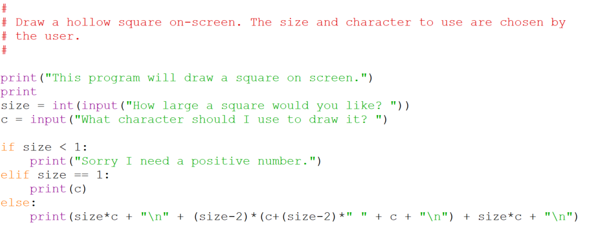

# Example: Draw a square

Write a program that reads in the size of a square and a character and then prints out a hollow square of that size using the specified character and blanks. Your program should work for squares of all sizes from 1 to 20 inclusive. Here is a sample run of the program,

    What size square? 5
    What character? *
    *****
    *   *
    *   *
    *   *
    *****

## Solutions:

This next one takes quite a different approach. If you can't tell what
it is from the code, ask for an explanation.

And here's one to wet your appetite. It does the job in one line(!) by
making use of some string operations.

