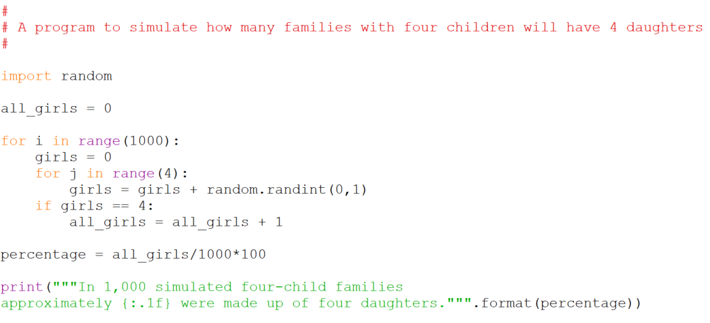

#Problem: What are the chances: four children, all girls?

Write a simulation program that estimates the percentage of 4-child families in which all the children are girls by simulating the formation of 1000 four-child families. Assume that the chances of a newborn being a girl or a boy are equal. A sample run of the program might look like this:

    In 1,000 simulated four-child families
    approximately 7% were made up of four daughters.

## Solution

