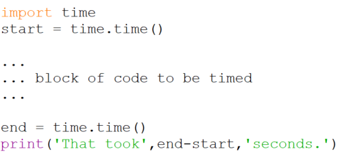
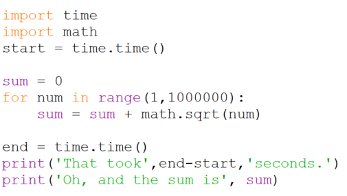

# Timing programs

Once your code is working, and you have tested it to ensure it works
correctly, you may need to try and make it faster. Making it faster
implies being able to measure its speed. Just as you measure the speed
of an athlete by timing them when they run a race we measure the speed
of a program by timing how long it takes to execute. The simplest way to
do this in Python is to use a program structured like this,

The function `time.time()` returns the current time in seconds since the
epoch*. By grabbing the time before the computations begin
in `start` and the time when they are completed in `end`. and then
finding their difference we can calculate how long the computations
took. Here is an example in which we see how long it takes to find the
sum of the square roots of the numbers from 1 to 1,000,000.

Truly accurate timing of program execution is much trickier than this
technique suggests. Unless you get the help of the operating system, the
timing shown above will depend on what else happens to be running on
your computer at the same time. More sophisticated timing is possible
using programs called profilers that measure the time more accurately
than our approach above.

---

* For more see the Python documentation
on [time](http://docs.python.org/library/time.html).

