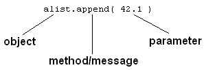

# Object-based programming

All the values we have worked with in Python have been objects, but we haven't really been aware of that because we've been able to work with them using built-in operators. For example we have been able to write `x = a + 10` and it has looked enough like regular arithmetic that we haven't had to address the fact that those things, `x` and `a`, are objects.

Aside 1: Already though we have seen that the meaning of the operator depends on the types of the objects to which it is applied. The `+` in `3 + 2` means arithmetic addition, but the `+` in `"Tim" + "Topper"` means string concatenation. Similarly the `%` in `9%5` means modulo, but the second `%` in `"%1.2f" % temp` means string interpolation. (Jargon alert: In object-oriented programming this is referred to as _polymorphism_ or more specifically _operator overloading_).

Aside 2: Remember that you can query the type of a literal value, or of the value associated with a name, by using the built-in function `type`, e.g.

```python
>>> type(4)
<class 'int'>
>>> type("Tim")
<class 'str'>
>>> x = 4.5
>>> type(x)
<class 'float'>
>>> last_name = "Topper"
>>> type(last_name)
<class 'str'>
>>>
``` 

where `int` is short for integer, `float` is short for floating point and `str` is short for string.

However, most object types provide more operations than there are built-in operators. In these cases we use a different notation to specify the operation to be performed. But to describe that notation it will help to have a little more jargon.

An object consists of a set of attributes and a set of methods it knows how to apply to itself. For example we can see that the string `last_name` above has as its attribute the sequence of characters `T o p p e r`, but what about its methods? One way to find an object's methods is to use the `dir()` command, e.g.

```python
>>> dir(last_name)
['__add__', '__class__', '__contains__', '__delattr__', '__doc__', '__eq__', '__ge__', '__getattribute__', '__getitem__', 
'__getnewargs__', '__getslice__', '__gt__', '__hash__', '__init__', '__le__', '__len__', '__lt__', '__mod__', '__mul__', 
'__ne__', '__new__', '__reduce__', '__reduce_ex__', '__repr__', '__rmod__', '__rmul__', '__setattr__', '__str__', 'capitalize',
 'center', 'count', 'decode', 'encode', 'endswith', 'expandtabs', 'find', 'index', 'isalnum', 'isalpha', 'isdigit', 'islower',
 'isspace', 'istitle', 'isupper', 'join', 'ljust', 'lower', 'lstrip', 'replace', 'rfind', 'rindex', 'rjust', 'rsplit', 'rstrip',
 'split', 'splitlines', 'startswith', 'strip', 'swapcase', 'title', 'translate', 'upper', 'zfill']
>>> 
```

The names beginning with double underscores `__` correspond to the methods invoked by operators, e.g. the `__add__` method is invoked when `+` appears between two string values. The names after the double underscore names are invoked by giving the name of the object followed by a period and then the name of the method followed by parentheses, e.g.

```python
>>> last_name.upper()
'TOPPER'
>>> last_name.center(20)
'       Topper       '
>>>
```

Note that when the method requires parameters they are listed in the parentheses, like 20 in the second command above.

In Python everything is an object. For instance we have seen this dot notation before, when importing the modules `random` and `math`. That's because an imported module is an object and we access the methods the module provides using this same dot notation. The dot notation for accessing object attributes and methods is common to most object-oriented languages including C++, Java, and Javascript.

The general syntax to invoke one of an object's methods is,

`object_name.method_name(parameters)`
where the parameters depend on the method, and may be optional as in `last_name.upper()` above, or provided as in `last_name.center(20)`.

## Jargon summary


