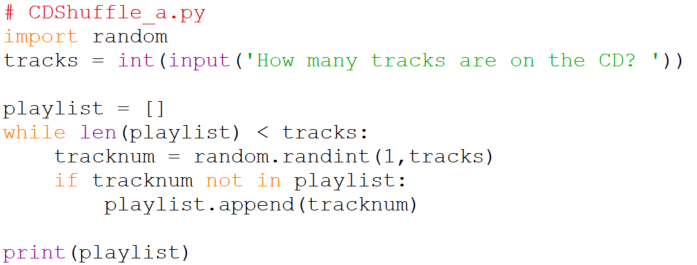
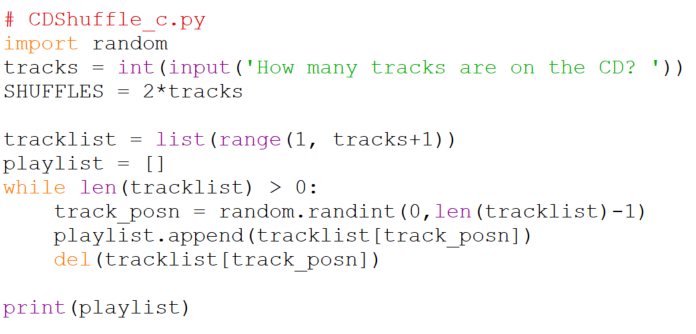

# Example: CD Shuffle

## A slightly dated problem

Most CD players have shuffle or random functionality in which they play the tracks on the CD in random order, but play each track exactly once. One way for them to do this is to scan the CD to see how many tracks there are on it, and then to generate a playlist of the order in which to play the tracks. For example if there are 6 tracks on the disc the playlist might be [3, 5, 2, 1, 6, 4]. We'd like to write a program to generate random playlists.

## Solution 1

A good starting point: Imagine we have to do this by hand. Our goal is to write down a playlist on a sheet of paper. But how to make the list random? If we use the CD above with 6 tracks on it we can roll a die to choose the tracks. For example let's say we roll it and get 4, we write 4 down as the first track on our playlist. We roll it again and get 1, so we write 1 down, then on the next roll we get 5 and write that down. On the next roll we roll 1 again, but since we already have 1 on our playlist we don't record it again, we just continue rolling. How long do we continue rolling? Until all 6 numbers have appeared on our playlist. Let's try writing this down in pseudocode form,

```plaintext
Initialize playlist (like getting a blank sheet of paper)
Until you have six numbers in the playlist
    Roll the die
    If the value of the die is not in the playlist
        Add it to the playlist
```

This translates into the following Python,

```python
playlist = []
while len(playlist) < 6:
    tracknum = random.randint(1,6)
    if tracknum not in playlist:
        playlist.append(tracknum)
print(playlist)
```

To more easily see how the English translates into Python here they are side-by-side,

Pseudocode:

```
Initialize playlist
Until you have six numbers in the playlist
    Roll the die
    If the value of the die is not in the playlist
        Add it to the playlist
 display the playlist
```  

Python code:

```python
playlist = []
while len(playlist) < 6:
    tracknum = random.randint(1,6)
    if tracknum not in playlist:
        playlist.append(tracknum)
print(playlist)
``` 

Wait! What about that 6? Not all CDs have exactly 6 tracks. We'll need to replace that by an appropriate variable name and get its value from the user. The result is,



_Exercise_. Try the program out. Does it work for all values of `tracks`? What would be good test values?[^*]

## Solution 2

An alternative approach takes its inspiration from the button name, i.e. "shuffle". If it says to _shuffle_ why not do just that? We can imagine having cards with the track numbers on them and shuffling those cards until they're mixed up. How would we do this in Python? We'll start with an ordered list of the track numbers, then we'll shuffle the list. We can shuffle it by choosing one item in the list at random and moving it to the end of the list. If we do that a bunch of times we'll end up with a shuffled list. The pseudocode is,

```plaintext
Generate an ordered list of the track numbers
Shuffle it to generate the playlist by
    selecting a random track from the list,
    and moving it to the end of the list.
```

Translating into Python gives us,


Be sure you understand each of the Python statements and how they are accurate translations of the pseudocode.

## Solution 3

Another approach combines features of both solutions. Like the first one
it builds the playlist up from nothing and like the second one it
selects tracks at random from an initially full playlist. The pseudocode
is,

```plaintext
Generate an ordered list of the track numbers.
Initialize the playlist.
Until the ordered list is empty,
    Select a random track from the ordered list,
    and move it to the playlist.
```
This avoids the inefficiency of the first solution when it generates
numbers that are already in the playlist[^*]. This one will never do
that because it only chooses from the remaining track numbers.

It also avoids the inefficiency of the second one which has to shuffle
many times to be sure it has sufficiently scrambled the original list.

The Python translation is,



---

[^*]: Remember "Test at the edges" so after trying a couple of typical
values like 6 and 10, it would be good to try 2, 1, and even 0.

[^*]: The number of duplicate generations goes up with the length of the
list. Here's an instrumented version of the program that displays the
number of duplicates generated as a function of list length. We call it
“instrumented” because of the addition of the variable `loops` that is
measuring its performance by counting iterations, and the addition of
the initial `for` loop that is forcing `tracks` to take on the values we
are interested in measuring. Run it and see how quickly the number of
duplicates grows; even at 10 tracks we can get 26 duplicates.

```python
# CDShuffle_dupes.py
import random
print('tracks | dupes')
print('-------+------')
for tracks in [1,2,5,10,20,50,100]:
    loops = 0
    playlist = []
    while len(playlist) < tracks:
        tracknum = random.randint(1,tracks)
        loops = loops + 1
        if tracknum not in playlist:
            playlist.append(tracknum)
    dupes = loops - tracks
    print("{:4d}   |{:5d}".format(tracks, dupes))
```
(For reliable output it should really run the program multiple times for
each value of tracks, but this program is meant to be illustrative
rather than a definitive measuring device.)
