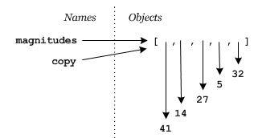
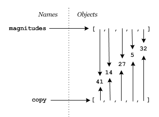
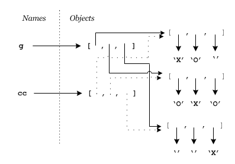

# Copying a list

## What doesn't work

As with changing a list, our first attempt at copying a list may not succeed. The most common thing students try is something like this,

```python
magnitudes = [41, 14, 27, 5, 32]
copy = magnitudes
```

Reasoning that copy will now contain a copy of magnitudes. Of course a moment's thought about how reference semantics works will show that `magnitudes` and `copy` are now both references to the same list object, i.e.



## What works (sort of) 1

One way to copy a list is to create an empty one, and then loop through the source list appending elements to the new one,

```python
magnitudes = [41, 14, 27, 5, 32]
copy = []
for m in magnitudes:
    copy.append(m)
```

this gets us what we wanted,



## What works (sort of) 2 and 3

Copying a list is so common that there are some Pythonic shortcuts available. One is to take a slice of the entire list and assign it to copy,

```python
copy = magnitudes[:]
```

This works because _slices create new objects_.

Another is to use the class constructor[^*]] for lists, `list`, to create a new list from an existing one,

```python
copy = list(magnitude)
```

## What's with the “(sort of)”?

Well sometimes these do all we want, but other times its important to realize they are all creating _first level_ copies of the lists. Recall our Tic-Tac-Toe lists:

```python
g = [['X', 'O', ''], ['O', 'X', 'O'], ['', '', 'X']]
```

Watch what happens when make a copy and then modify the copy,

```python
>>> g = [['X', 'O', ''], ['O', 'X', 'O'], ['', '', 'X']]
>>> cc = g[:]
>>> print(cc)
[['X', 'O', ''], ['O', 'X', 'O'], ['', '', 'X']]
>>> cc[0][0] = 'A'
>>> print(cc)
[['A', 'O', ''], ['O', 'X', 'O'], ['', '', 'X']]
>>> print(g)
[['A', 'O', ''], ['O', 'X', 'O'], ['', '', 'X']]
>>>
```

Do you see it? Changing element `cc[0][0]` to `'A'` also changed element `g[0][0]`. But if `cc` is a copy of `g` that shouldn't have happened! The problem is that `cc` isn't a complete copy of `g`. It only copied the first level references in `g`. Those references still point to the same sublist objects, i.e.



So since `cc[0]` and `g[0]` still reference the same list object, changing `cc[0][0]` changes `g[0][0]`.

## Deep copying

As the Tic-Tac-Toe example shows sometimes we have objects containing references to other objects, and in some applications there can be far more than just two levels of reference. What to do if we still need a copy of the complete structure? This comes up often enough that Python provides a standard library function to create the copy for you,

```plaintext
>>> import copy
>>> g = [['X', 'O', ''], ['O', 'X', 'O'], ['', '', 'X']]
>>> cc = copy.deepcopy(g)
>>> cc[0][0] = 'A'
>>> print(cc)
[['A', 'O', ''], ['O', 'X', 'O'], ['', '', 'X']]
>>> print(g)
[['X', 'O', ''], ['O', 'X', 'O'], ['', '', 'X']]
>>>
```

## Summary

Create a shallow copy using a slice, `copy = original[:]`

or the list constructor, `copy = list(original)`.

If a deep copy is needed (it often isn't), use the copy
module, `copy = copy.deepcopy(original)`.

---

[^*]: We used these before for converting from one object type to another,
but they can also be used to create another object of one type from an
existing object of that same type.
