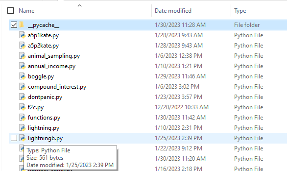

# What are these pyc files?

By now you may have noticed a folder `__pycache__` of `.pyc` files
appearing in your working directories without your having created them.
While it's true you didn't manually create them you did cause them to
be created. Remember that when you import a module it is executed. One
result of this execution is a `.pyc` file. Those `pyc` files are compiled
versions of modules. Having them makes later imports quicker because the
modules do not have to be recompiled; instead the `pyc` file can be used
immediately. So, each time you import a module you trigger the creation
of a `pyc` file. You can delete them if they annoy you, but it will slow
later imports, and they'll get recreated when needed anyway.
