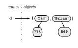

# What can you do with a dictionary?

The full list of methods is in [Section 5.5 of the Python Library
Reference](https://docs.python.org/3/tutorial/datastructures.html#dictionaries).
Here's an idea of how you might use and combine these methods to carry
out common operations.

Create a dictionary,

-   Using a dictionary literal*,
    e.g. `d = { 'Tim' : 775, 'Brian' : 869 }` we can visualize the
    dictionary that is created like this,

    

Access an element,

-   `print(d['Tim'])`

The general pattern here
is *`dictionary_name`*`[ `*`key`*` ] = `*`value`*. So to modify a value,

-   `d['Tim'] = 820`

and to insert a new value,

-   `d['Doug'] = 870`

Check to see if there is already an entry with a particular key,

-   `'Brian' in d` will return `True`
-   `'Jill' in d` will return `False`

Delete an entry in the dictionary (both the key and its associated
value),

-   `del( d['Brian'] )`

Remove an entry, but get the value,

-   `d.pop('Tim')` removes the key value pair 'Tim':820 from the
    dictionary but returns `820`

Find out how many key-value pairs are in the dictionary,

-   `len( d )`

Get a list of all the keys in the dictionary,

    >>> d.keys()
    dict_keys(['Tim', 'Doug'])
    >>>

(Note the square brackets and commas: `d.keys` returns a dict_keys
object. You have to cast it explicitly to use it as a list.)

    >>> list(d.keys())
    ['Tim', 'Doug']
    >>>

You don't have to cast it to a list to iterate through it with a for
loop. This is often used for iterating through the entries in the
dictionary, e.g.

    for key in d.keys():
        print(key, ':', d[key])

produces the output,

    >>> 
    Tim : 820
    Doug : 870
    >>> 

This can also be shortened to,

    for key in d:
        print(key, ':', d[key])

Get a dict_values object of all the values that occur in a dictionary,

    >>> d.values()
    dict_values([820, 870])
    >>> 

To make a dict_values object a list cast it using list(),

    >>> list(d.values())
    [820, 870]
    >>> 

Delete all the entries in the dictionary,

    >>> d.clear()
    >>> d
    {}
    >>> 

Note that the name `d` still exists; it just references (points at) an
empty dictionary.

Finally note that the **keys** don't have to be strings they can be any
[immutable type]{.underline}, and the **values** can be any Python
object, e.g.

    >>> d['Tim'] = 775
    >>> d[3] = ['a', 'small', 'list']
    >>> d[(0,1)] = 'X'
    >>> d
    {(0, 1): 'X', 'Tim': 775, 3: ['a', 'small', 'list']}
    >>> for key in d:
        print(key, ':', d[key])
    (0, 1) : X
    Tim : 775
    3 : ['a', 'small', 'list']
    >>> 

------------------------------------------------------------------------

*_Literals_are how to write out values.

-   `4` is an integer literal,
-   `4.1` is a floating point literal,
-   `'Tim'` is a string literal,
-   `[0, 'Hi']` is a list literal (notice the square brackets),
-   `(0, 1)` is a tuple literal (notice the round parentheses), and
-   `{ 'Tim' : 775, 'Brian' : 869 }` is a dictionary literal (notice the
    curly brackets).
