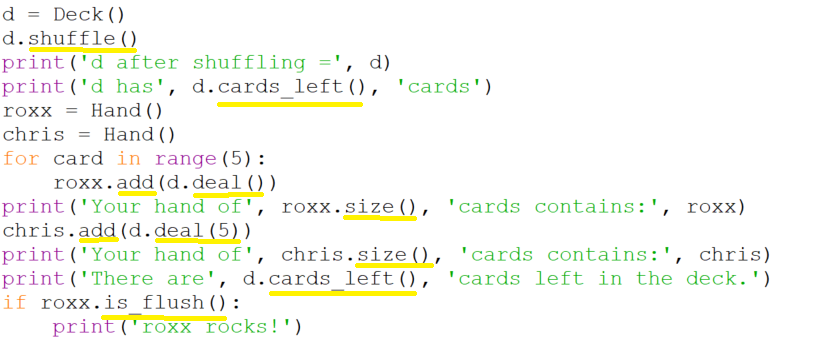

# Identifying the classes' methods

Our next step is to identify the methods these classes must provide. To
do so we look for method syntax that is we look for the
pattern *`object`*`.`*`method`*`()`. Note that the parentheses are
important. With them we know we are looking at a method, without them it
would be an object attribute.

The methods prefixed with the `Deck` object name `d` indicate that
the `Deck` class must provide the methods

-   `shuffle`,
-   `cards_left`, and
-   `deal`

Furthermore if we look closely we can see that `deal` has an optional
parameter that defaults to 1 based on the difference between the
usages `d.deal()` and `d.deal(5)`.

Similarly the methods prefixed with the names of
the `Hand` objects `roxx` and `chris` indicate that the `Hand` class
must provide

-   `add`,
-   `size`, and
-   `is_flush`.
