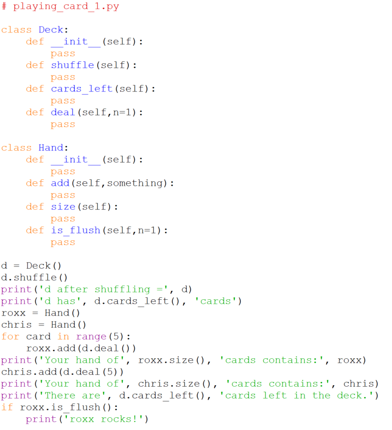

# Program skeleton 1

Based on the classes and methods we have identified we can add empty
class and method definitions above our specification code. This is
sometimes called stubbing out the methods:

Notes:

-   Note the use of the `pass` statement as a placeholder.
-   Remember that the `__init__` methods are **required** and will
    contain the code necessary to construct an object of each type.
