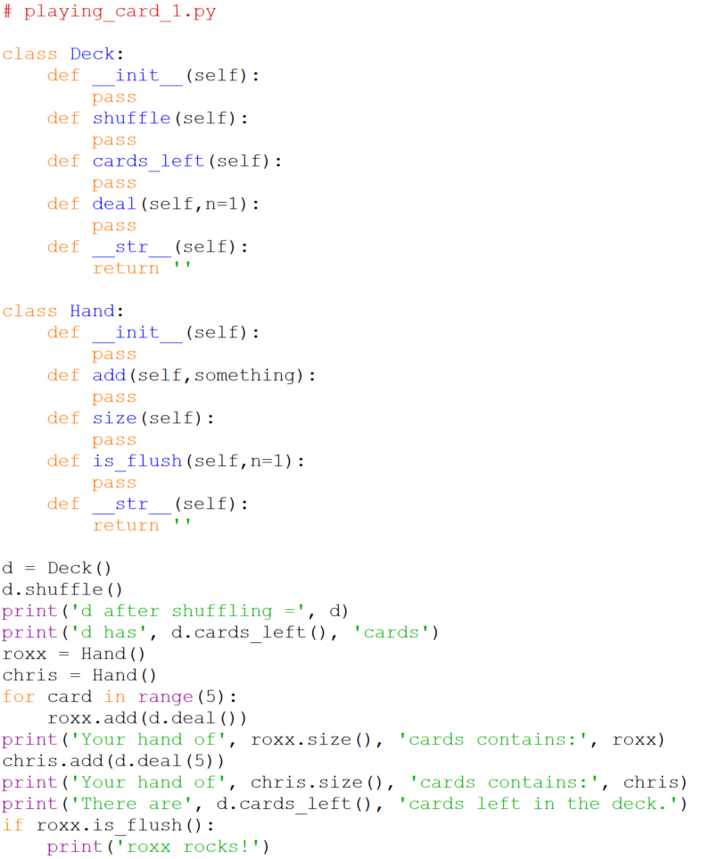

# Program Skeleton 2

Adding in the \_\_str\_\_ methods gives us:

which when run produces,

    >>> 
    d after shuffling = 
    d has None cards
    Your hand of None cards contains: 
    Your hand of None cards contains: 
    There are None cards left in the deck.
    >>> 

Note that we can't use pass in the `__str__` methods because they are
required to return a string, so instead we return a null string in each
one.
