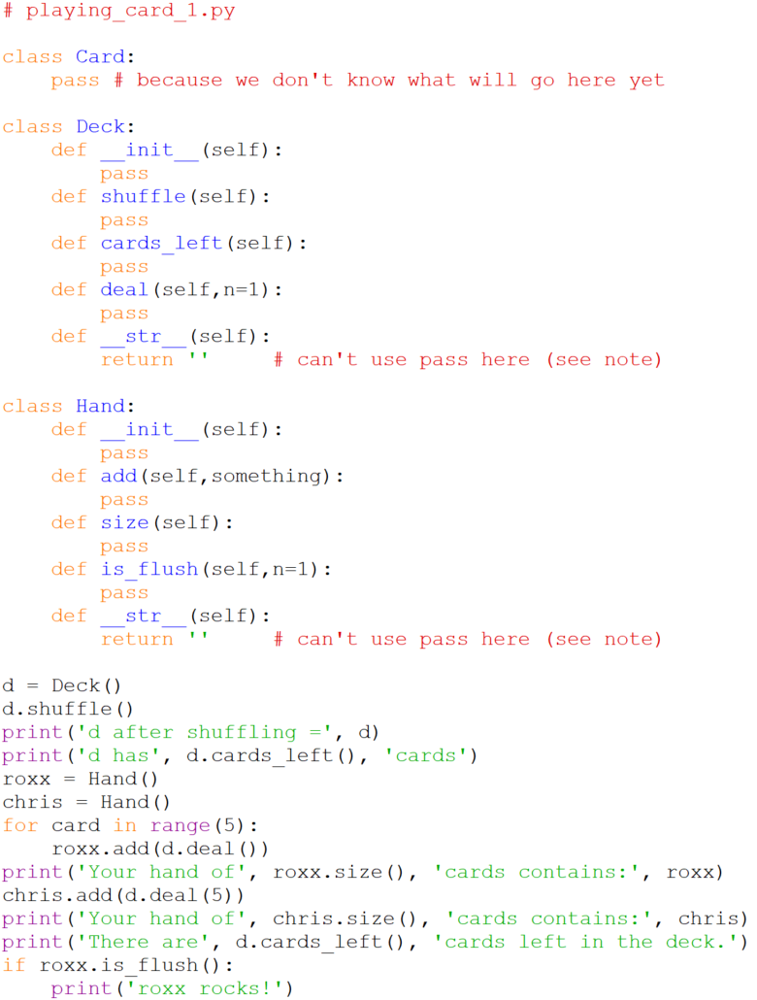

# An invisible class too!

Our analysis of the classes required by our specification is sound as
far as it goes, but it leaves something out. Deck and Hand are both what
are called _collection classes_. They each collect a group of objects of
another type. What then is this other type? Well decks of cards and
hands of cards are both made up of cards, so our code will also require
a `Card` class. It is not easy to tell what methods this card class will
have to provide since none are explicitly visible, but we'll add an
empty `Card` class to our module now, and add methods to it later as we
discover they are necessary in working on our `Deck` and `Hand` classes:

