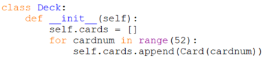
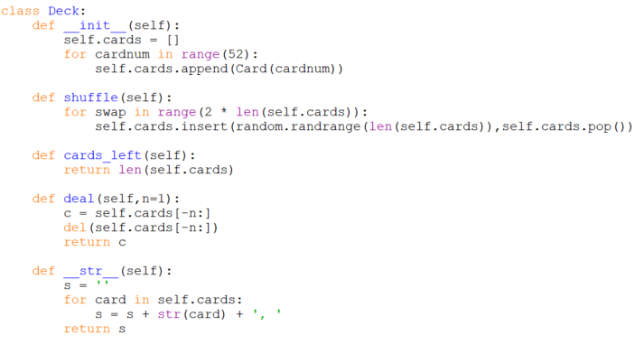

# Deck methods

Let's begin filling in our empty class methods. A `Deck` is an ordered
collection of cards so a list is a natural choice of container. Thus
a `Deck`'s sole attribute will be the list of cards. When we initialize
a new `Deck` we need to fill the list with all 52 possible `Card`s:

Notice that to do this we begin with an empty list, then append to that
list each one of 52 unique `Card` objects. The `Card` objects are
created by calling the card constructor `Card` and passing it an id
number, so now we know the `Card` constructor will take an argument
specifying the card to create, i.e. `def Card(self, num):`

The remaining `Deck` methods are straightforward reworkings of our
earlier playing card functions, but now embedded into a class:

