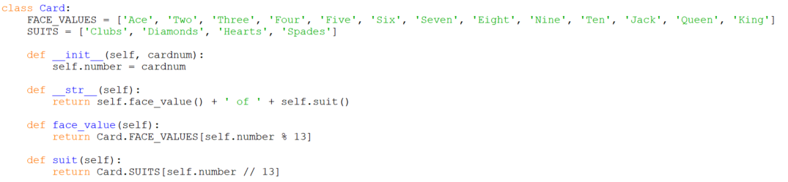

# Card Methods

Looking at the code for our Deck and Hand classes we can see explicit
calls to the `Card` constructor `__init__` invoked
by `Card(cardnum)` and the `__str__` method invoked via `str(card)`. The
necessary Card class can be written as,

Notes:

-   A `Card` object has a single attribute: its card number.
-   The `__str__` method calls on two other `Card` methods to get the
    string representations of the card's face value and
    suit: `face_value` and `suit`.
-   The lists `face_values` and `suits` are *class variables*. All
    members of the class share access to them. Note that they are
    accessed by prefixing them with the class name, i.e. we
    use `Card.suits` not just `suits`.
