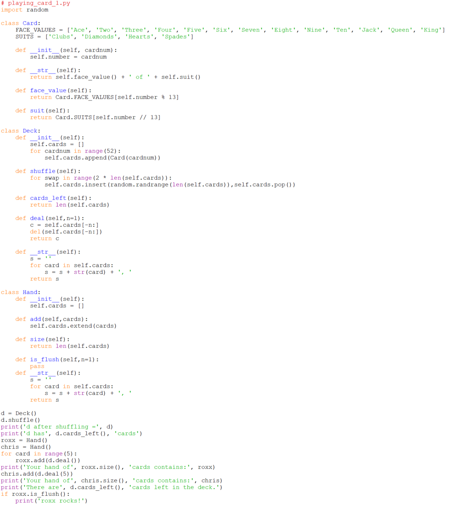

# Putting all the pieces together

Notes:

-   I've added a `__name__` testing `if` to make this an `import`able
    module.
-   The keen-eyed among you will notice the use of the `\n` newline
    character to control spacing.
