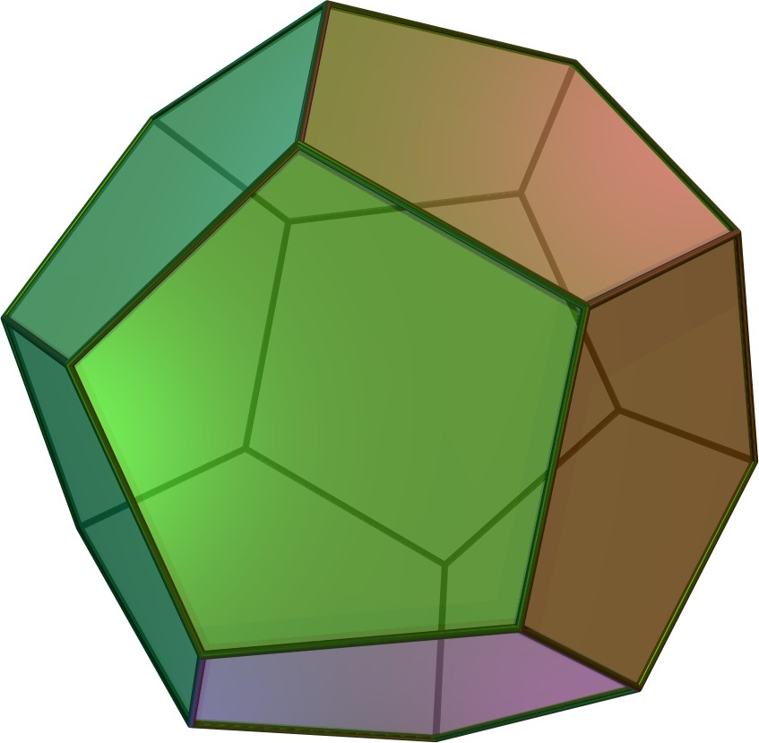

# About Hunt the Wumpus

Hunt the Wumpus was one of the first interactive computer games. It is
often cited as the first Interactive Fiction game, and sometimes as the
first game written for a microprocessor (as opposed to a minicomputer or
mainframe). As usual Wikipedia has  [a fine background
article](http://en.wikipedia.org/wiki/Wumpus) about it. There are
several online implementations of the game, e.g.
[[1](http://www.dreamcodex.com/wumpus.php)] and
[[2](http://www.funkypages.com/games/wumpus.php)] so you can try it
out before we begin building our own version. The original version was
written in 1970 in BASIC, but it has since been translated into many
other languages ([including
Python](http://granite.sru.edu/~conlon/python_page.html)). For interest,
here's  [the original BASIC source
code](http://www.atariarchives.org/morebasicgames/showpage.php?page=179)— **users
would type this in** (!) in order to play the game.

I hope you realized from its age that this is a text-based game and not
a graphical first person shooter. If not, this short game transcript
should make it clear, and also demonstrate the game and explain the
rules:

```plaintext
    Welcome to "Hunt the Wumpus"
     
    The wumpus lives in a cave of 20 rooms. Each room has 3 tunnels to
    other rooms. (Look at a dodecahedron to see how this works. If you
    don't know what a dodecahedron is, ask someone.)
     
    Hazards:
     Bottomless pits - Two rooms have bottomless pits in them. If you go
     there, you fall into the pit (& lose)!
     Super bats - Two other rooms have super bats. If you go there, a
     bat grabs you and takes you to some other room at random (which
     may be troublesome).
     
    Wumpus:
     The wumpus is not bothered by hazards. (He has sucker feet and is
     Too big for a bat to lift.) Usually he is asleep. Two things
     wake him up: Your shooting an arrow, or your entering his room.
     If the wumpus wakes, he moves (p=.75) one room or stays still
     (p=.25). After that, if he is where you are, he eats you up and
     you lose!
     
    You:
     Each turn you may move or shoot a crooked arrow.
     Moving: You can move one room (Through one tunnel).
     Arrows: You have 5 arrows. You lose when you run out. Each
     arrow can go from 1 to 3 rooms. You aim by telling the
     computer the rooms to which you want the arrow to go. If the
     arrow can't go that way (if no tunnel) it moves at random to
     the next room.
     If the arrow hits the wumpus, you win.
     If the arrow hits you, you lose.
     
    Warnings:
     When you are one room away from a wumpus or hazard, the computer
     says:
     Wumpus: "I smell a wumpus!"
     Bat : "Bats nearby!"
     Pit : "I feel a draft!"
     
    You are in room 12.
    There are tunnels to rooms 11, 13, and 19.
    I feel a draft!
    Shoot, move, or quit (s/m/q)? m
    To which room (11, 13, or 19)? 13
    AEEEIIIIII! You fell into a pit!
```

I won't make you ask by email about the dodecahedron :-) A dodecahedron looks like this:



In our game the vertices (the corners or points) correspond to the
locations of the rooms, and the edges (or ridgelines) correspond to the
tunnels that connect caves. You can see that each cave is connected to
three others. For our purposes it is easier to work with a "squashed"
version (imagine someone steps on the 3-D picture above and squashes it
flat):


