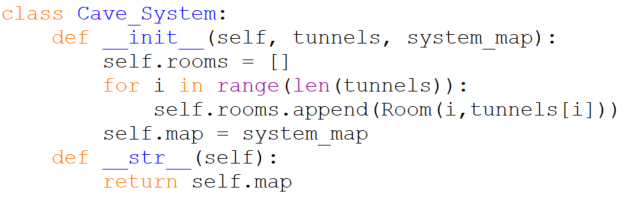
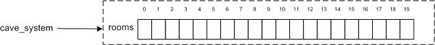

# `class Cave_System`

Generally I like to write my classes from simplest to most complicated,
but that's not always possible. In this case for instance because all
our other objects need to refer to the cave system we have to begin with
its class definition.

Recall that in our first pass at the cave system object we said it
consists of_multiple_rooms connected by_multiple_tunnels. This means
that it will have to be a container type of some sort.

-   Attributes: **20 caves**; the **pattern of connections** between
    caves.
-   Methods: Should be able to tell us **where you can go from
    here**/what rooms are connected to this one; if a room **has a
    bat**; if a room **has a pit**; if the **player is in** a room.

Looking at our pseudocode it looks like I was right about the container
type, notice the square brackets in lines 6 and 9 which indicate a list:

     6         print('Choose from: ', cave_system.rooms[player.location].tunnels)
     ...
     9         new_room = cave_system.rooms[player.location] # Note simplifying alias.

Those show us that `Cave_System`s have a `rooms` attribute that is a
list. Based on its name `rooms` is a list of the `Room` objects in the
cave system. Now how to represent the *pattern of connections* between
rooms? One simple way would be for each `Room` to know what
other `Room`s it is connected to, and that seems like a reasonable thing
for a `Room` object to know so we'll make it an attribute
of `Room` objects. Looking at line 6 above you can see that that's how
it's written: the `Room`s in the `Cave_System`'s `rooms` attribute
have an attribute `tunnels` that presumably lists the rooms the tunnels
connect this room to.

So far so good, but I didn't do as well in my initial guess about the
cave system's methods. My initial guess was that a cave system "should
be able to tell us **where you can go from here**/what rooms are
connected to this one; if a room **has a bat**; if a room **has a pit**;
if the **player is in** a room." But, if you look at the pseudocode
where these questions are actually asked you can see that they are asked
of `Room` objects not of the cave system as a whole:

    10         if new_room.has_bat():
                   ...
    12         elif new_room.has_pit():
                   ...
    15         elif new_room.has_wumpus():
                   ...

This means that these methods properly belong to `Room` objects
not `Cave_System`s so we'll move them there.

What methods_do_cave systems have then? Almost none, but there is one
slightly non-obvious one. Try spotting it\...

Did you spot it in this line?

     2     print(cave_system)

There's no explicit method call there, i.e. no parentheses, but
remember that for an object to be printable it has to provide
an `__str__` method so there is an implicit call
to `cave_system.__str__` in this line. Thus a `Cave_System`'s only
method (beyond `__init__` ) will be \_\_str\_\_.

In sum this class doesn't have that much in it. It has to initialize a
list of `Room` objects and provide a `__str__` method. Here's its code,

Note that the constructor is passed a list of tunnel connections between
rooms and a map of the system. We can tell `tunnels` is a list because
of the way it is used with square brackets in the sixth
line: `tunnels[i]`. We can tell `system_map` will need to be a string
containing a printable map of the system because it is returned
by `__str__` and that method_has_to return a string. To make this more
concrete here's the code to create a `Cave_System` object corresponding
to our squashed dodecahedron cave system:

    TUNNELS = [[1,7,19], [0,2,14], [1,3,6], [2,4,13], [3,5,11],
               [4,6,9], [2,5,7], [0,6,8], [7,9,18], [5,8,10],
               [9,11,17], [4,10,12], [11,13,16], [3,12,14], [1,13,15],
               [14,16,19], [12,15,17], [10,16,18], [8,17,19], [0,15,18]
              ]
    MAP = '''
         19 - - - - - - - - - - - - - - - -  15
        /   \                               /  \ 
       /     \     - - - - 1 - - - -       /    \ 
      /       \   /        |         \    /      \ 
     /         \ /         |          \  /        \ 
     |          0          2           14          |
     |         /          / \           \          |
     |        /         /     \          \         |
     |       /        /         \         \        |
     |      7 - - - 6             3 - - - 13       |
     |       \       \           /        /        |
     |        \       \         /        /         |
    18 - - - - 8       5 - - - 4        12 - - - - 16
      \         \     /          \     /          /
       \         \  /              \  /          /
        \         9 - - - 10 - - -  11          /
         \                 |                   /
          \                |                  /
           \               |                 /
             - - - - - -  17 - - - - - - - -
    '''
    cave_system = Cave_System(TUNNELS, MAP)

What does cave_system look like in memory? We can picture it like this:

