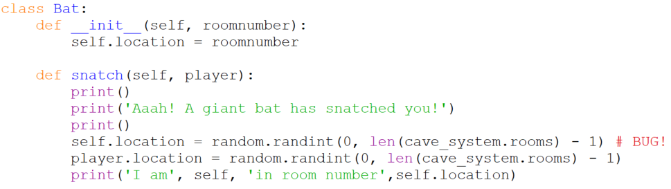

# `class Pit`

We'll write our remaining classes from simplest to most complex. You'll
recall that a pit has one attribute, `location`, and just one
method, `swallow`. In Python:

In a modern graphic game a `Pit`'s `swallow` method would trigger some
fabulous animation of the player tumbling downward, but since this is
text-based we have to settle for saying what is happening, and leaving the special effects to the user's imagination.
