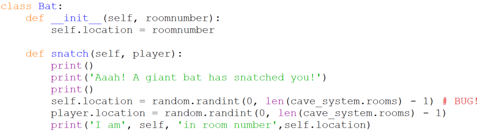

# `class Bat`

Like `Pit`s, `Bat`s have one attribute, `location`, and one method
called `snatch`. Snatching is a little more involved than swallowing.
The bat has to move the player to a new randomly chosen room and then
flap off to another randomly chosen room.

We will correct the bug shortly. In the meantime you might want to think
about it and see if you can determine what the bug is.
