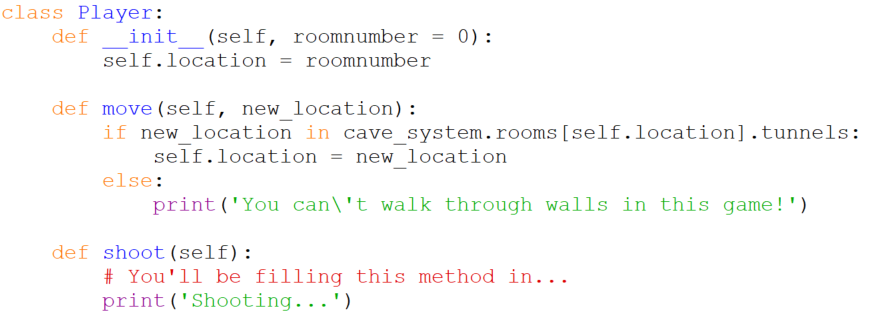

# `class Player`

Like the other objects in the cave system `Player`s have locations. They
also have two methods: they can `move` and they can `shoot` arrows.

Note that the `move` method receives an argument saying what room to
move to, but it doesn't blindly trust the argument to be valid and
instead checks that the destination room is linked to the current room.
